## {data-background-image="images/climate-stripes.jpg" data-background-size="cover"}

::: {style="text-align: left; position: absolute; bottom: 150px; left: 50px;"}

<h2 style="margin: 0; color: white;">Designing Effective Data Visualizations</h2>

Pedro Cardoso-Leite

<a href="mailto:pedro.cardosoleite@uni.lu" style="color: white;">pedro.cardosoleite@uni.lu</a>

:::

<a href="https://ed-hawkins.github.io/climate-visuals/stripes.html" style="color: white !important; text-shadow: 1px 1px 3px rgba(0, 0, 0, 0.8);">The Global Warming Stripes by Ed Hawkins.</a>

## Let's start with a story... {.center}

## {.center}

::: {style="display: flex; gap: 0px; align-items: center; justify-content: center; margin-top: 0px;"}
{style="height: 700px; width: auto;"}

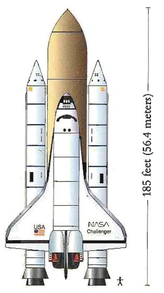{style="height: 700px; width: auto;"}
:::

::: footer
The Challenger Space Shuttle January 28, 1986
:::

## {.center}

The night before...

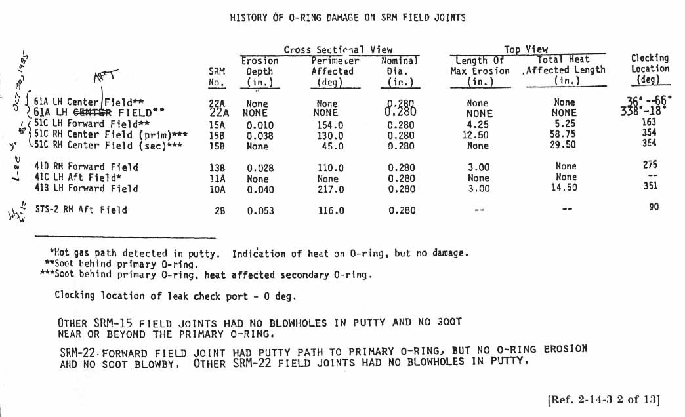{fig-align="center" width="90%" .img-shadow}

## {.center}

::: {style="display: flex; align-items: center; height: 100%;"}
::: {style="flex: 1; padding-right: 40px;"}

What's the issue?

:::

::: {style="flex: 1; display: flex; justify-content: flex-end;"}
{style="height: 700px; width: auto; box-shadow: 0 10px 30px rgba(0,0,0,0.3);"}
:::
:::

::: {.fragment fragment-index="6" style="position: absolute; top: 380px; left: 600px; text-align: center; line-height: 1.6;"}
[O-rings]{.annotation-text}\
[might get damaged]{.annotation-text}\
[when it's too cold.]{.annotation-text}
:::

<svg class="fragment" data-fragment-index="6" style="position: absolute; top: 0; left: 0; width: 100%; height: 100%; pointer-events: none;">
<defs>
<marker id="arrowhead" markerWidth="10" markerHeight="10" refX="9" refY="3" orient="auto">
<polygon points="0 0, 10 3, 0 6" class="arrowhead-orange" />
</marker>
</defs>
<!-- Curved arrow using path with quadratic bezier curve -->
<path d="M 870 420 Q 950 400, 1255 382" class="arrow-orange" marker-end="url(#arrowhead)" />
</svg>

## {.center}

:::: {style="position: relative; width: 70%; margin: 0 auto;"}
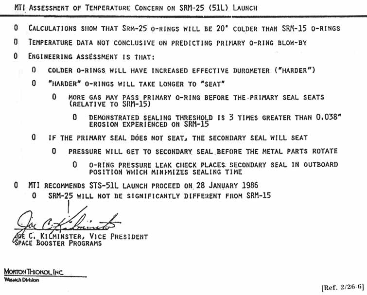{width="100%" .img-shadow}

::: {.fragment style="position: absolute; top: -1%; left: 0; width: 100%;"}
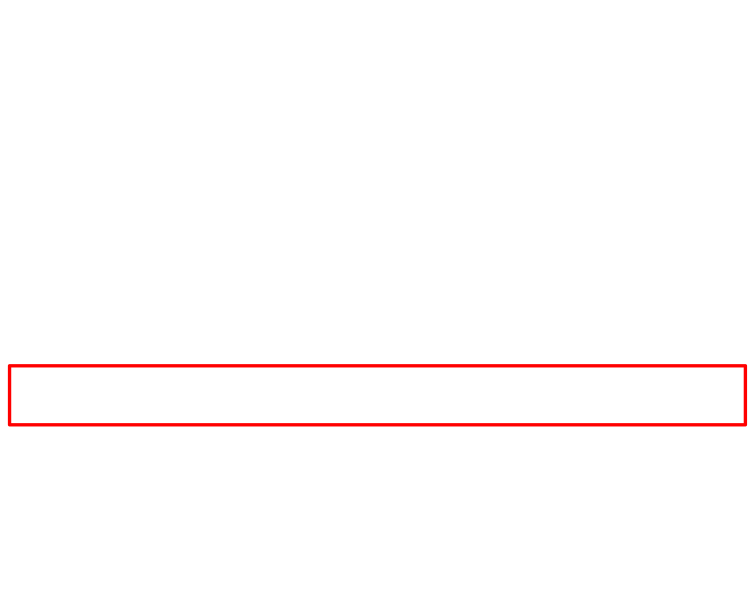{width="100%"}
:::
::::

## {background-iframe="https://www.youtube.com/embed/OtzgbG8ZgdM?autoplay=1" background-interactive="true"}

## What happened?

## {.center}

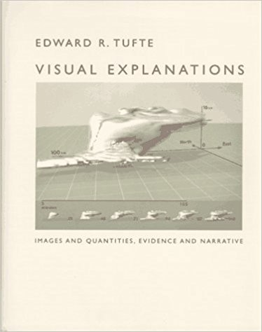{fig-align="center" width="70%" .img-shadow}

## What happened?
- What was the concern?
- What data / information should they have shared?

<!-- list of exchanges -->
## {.center}

:::::::::::::::::::::::::::::::::::: {style="display: flex; gap: 30px; padding-top: 50px;"}
::::::::::::::::::::::::::::: {style="display: flex; flex-direction: column; gap: 8px;"}
::: {.fragment .fade-out .box-white fragment-index="2"}
:::

::: {.fragment .box-black fragment-index="2"}
:::

::: {.fragment .fade-out .box-white fragment-index="2"}
:::

::: {.fragment .box-black fragment-index="2"}
:::

::: {.fragment .fade-out .box-white fragment-index="2"}
:::

::: {.fragment .box-black fragment-index="2"}
:::

::: {.fragment .fade-out .box-white fragment-index="2"}
:::

::: {.fragment .box-black fragment-index="2"}
:::

::: {.fragment .fade-out .box-white fragment-index="2"}
:::

::: {.fragment .box-black fragment-index="2"}
:::

::: {.fragment .fade-out .box-white fragment-index="2"}
:::

::: {.fragment .box-black fragment-index="2"}
:::

::: {.fragment .fade-out .box-white fragment-index="4"}
:::

::: {.fragment .box-gray fragment-index="4"}
:::

::: {.fragment .fade-out .box-white fragment-index="4"}
:::

::: {.fragment .box-gray fragment-index="4"}
:::

::: {.fragment .fade-out .box-white fragment-index="4"}
:::

::: {.fragment .box-gray fragment-index="4"}
:::

::: {.fragment .fade-out .box-white fragment-index="4"}
:::

::: {.fragment .box-gray fragment-index="4"}
:::

::: {.fragment .fade-out .box-white fragment-index="4"}
:::

::: {.fragment .box-gray fragment-index="4"}
:::

::: {.fragment .fade-out .box-white fragment-index="4"}
:::

::: {.fragment .box-gray fragment-index="4"}
:::

::: {.fragment .fade-out .box-white fragment-index="5"}
:::

::: {.fragment .box-yellow fragment-index="5"}
:::
:::::::::::::::::::::::::::::

:::::::: {style="flex: 1; display: flex; flex-direction: column; padding-top: 0;"}
::: {.fragment fragment-index="1" style="min-height: 48px; display: flex; align-items: center; padding-left: 0px;"}
**Of the 13 charts** circulated by Thiokol managers and engineers to the scattered teleconferees,
:::

::: {.fragment fragment-index="2" style="min-height: 200px; display: flex; align-items: center; padding-left: 40px;"}
**six contained no tabled data** about either O-ring temperature, O-ring blow-by, or O-ring anomaly (these were primarily outlines of arguments being made by the Thiokol engineers).
:::

::: {.fragment fragment-index="3" style="min-height: 20px; display: flex; align-items: center; padding-left: 80px;"}
**Of the seven remaining charts containing data,**
:::

::: {.fragment fragment-index="4" style="min-height: 100px; display: flex; align-items: center; padding-left: 120px;"}

**six of them included data on either launch temperatures or O-ring anomaly  but not both** in relation to each other.

:::

::: {.fragment fragment-index="5" style="display: flex; align-items: center; padding-left: 160px;"}
**Only one chart** relating O-ring temperature and O-ring damage was prepared by a Thiokol engineer.
:::
::::::::
::::::::::::::::::::::::::::::::::::

::: {.fragment data-fragment-index="6" style="position: absolute; top: 800px; left: 300px;"}

Let's focus on this one document.

:::

<!-- arrow -->

<svg class="fragment" data-fragment-index="6" style="position: absolute; top: 0px; left: 0px; width: 100%; height: 100%; pointer-events: none; z-index: 1000; overflow: visible;">
<defs>
<marker id="arrowhead-orange-box" viewBox="0 0 10 10" refX="8" refY="5" markerWidth="6" markerHeight="6" orient="auto">
<polygon points="0 0, 10 5, 0 10" fill="black" />
</marker>
</defs>
<path d="M 300 830 Q 180 830, 50 680" stroke="black" stroke-width="3" fill="none" marker-end="url(#arrowhead-orange-box)" />
</svg>

## {.center}

::: {style="display: flex; gap: 20px; align-items: flex-start; justify-content: center; height: 100%;"}
::: {style="flex: 3;"}
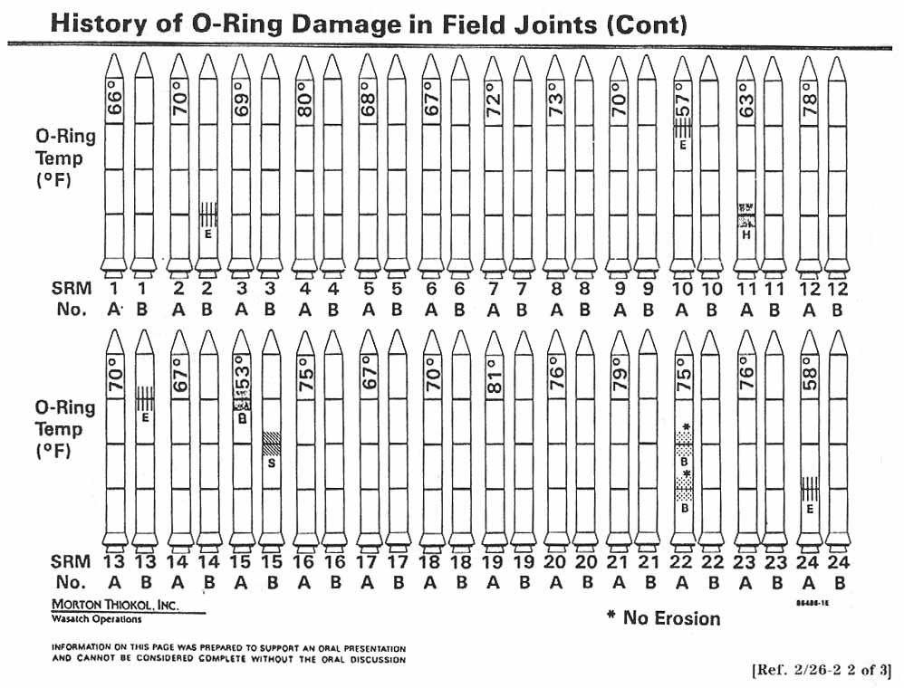{width="100%" .img-shadow}
:::

::: {style="flex: 1;"}
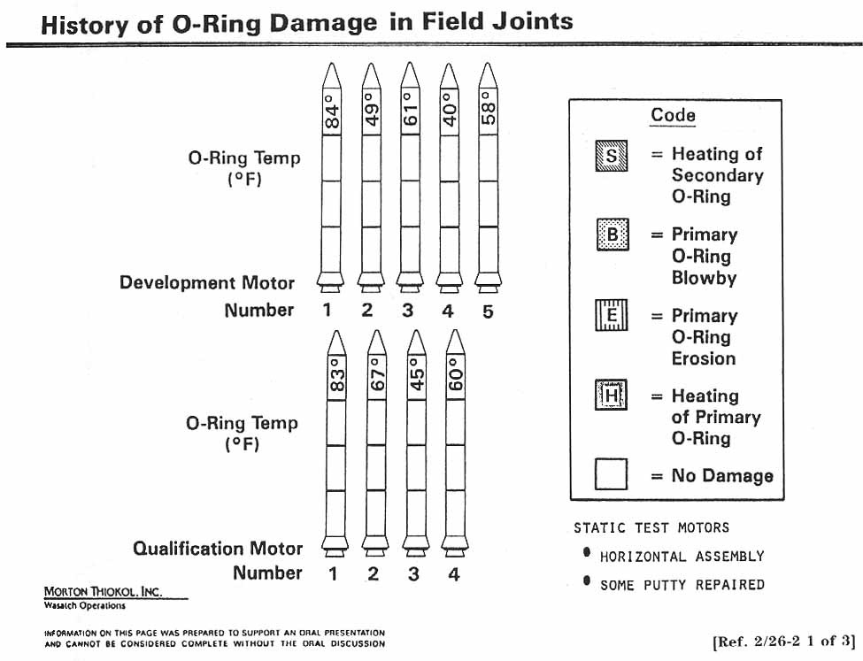{width="100%" .img-shadow}
:::
:::

## {.center}

{fig-align="center" width="50%" .img-shadow}

## {.center}

{fig-align="center" width="50%" .img-shadow}

## What do you think about this chart?

## {.center}

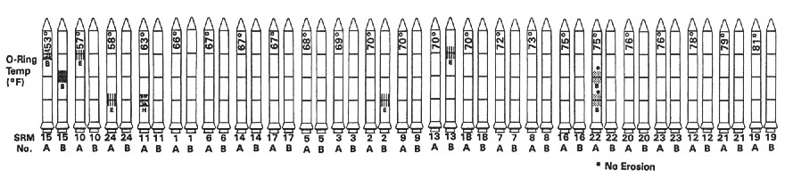{fig-align="center" width="70%" .img-shadow}

## {.center}

::: {style="text-align: center;"}
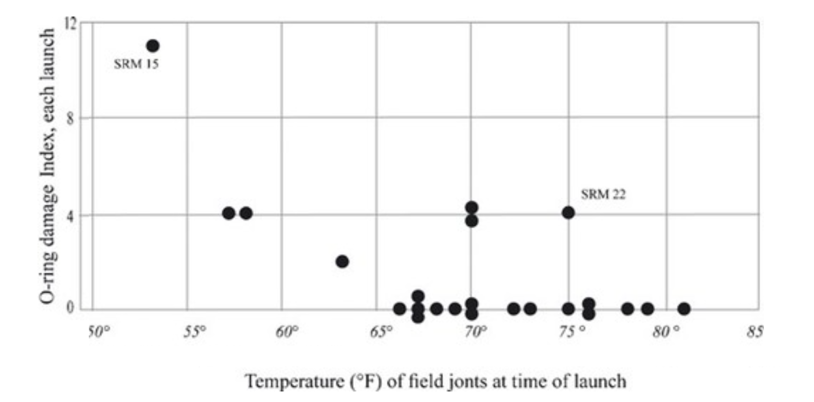
:::

::: footer
Edward Tufte's redesigned chart from "Visual Explanations"
:::

## {.center}

{width="100%" .img-shadow}

::: footer
Edward Tufte's redesigned chart from "Visual Explanations"
:::

# One more story...

## {background-iframe="https://www.youtube.com/embed/lNjrAXGRda4?autoplay=1" background-interactive="true"}

::: notes
other interesting videos:
 - https://www.youtube.com/watch?v=VJ86D_DtyWg
 - https://www.youtube.com/watch?v=Pq32LB8j2K8

:::

##

show graph of John Snow
show a more modern version

https://flourish.studio/blog/masters-john-snow/

# Let's have a look at some numbers...

<!-- Anscombe's 
 Do we really need to visualize data?
-->

## 

<object type="image/svg+xml" data="images/anscome_slide_gs.svg" style="width: 80%; max-width: 1400px;">
  Your browser does not support SVG
</object>

::: {.fragment style="position: absolute; bottom: 30px; left: 50%; transform: translateX(-50%); text-align: center; line-height: 1.6;"}
[What can you tell me about these four datasets?]{.annotation-text}\
[Are they the same?]{.annotation-text}
:::

## What can you say about these four datasets?

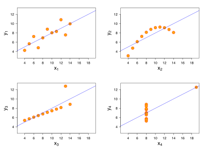

## Anscombe's Quartet

- Constructed in 1973 by statistician **Francis Anscombe**
- Demonstrates the importance of **graphing data**
- Shows the effect of **outliers** on statistical properties
- Intended to counter the impression among statisticians that **"numerical calculations are exact, but graphs are rough."**

::: aside
[Wikipedia: Anscombe's quartet](https://en.wikipedia.org/wiki/Anscombe%27s_quartet)
:::

## 

*"The greatest value of a picture is when it forces us to notice what we never expected to see."*

 

**John W. Tukey**

## The data science workflow

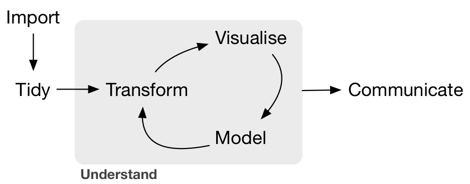{fig-align="center" width="90%" .img-shadow}

::: aside
Source: [R for Data Science](https://r4ds.hadley.nz/)
:::

## The two reasons for visualizing data

{fig-align="center" width="90%" .img-shadow}

::: aside
Source: [R for Data Science](https://r4ds.hadley.nz/)
:::
::: {.fragment data-fragment-index="1" style="position: absolute; top: 480px; left: 720px; width: 190px; height: 80px; border: 6px solid red; background-color: transparent;"}
:::

::: {.fragment data-fragment-index="2" style="position: absolute; top: 170px; left: 720px; width: 250px; height: 80px; border: 6px solid red; background-color: transparent;"}
:::

# What have learned?

## The two purposes of data visualization

<link rel="stylesheet" href="https://cdnjs.cloudflare.com/ajax/libs/font-awesome/6.4.0/css/all.min.css">

*The key function of data visualization is to move information from point A to point B.*

In exploratory visualization,

<i class="fas fa-table" style="font-size: 3em; color: var(--color-gray-dark);"></i>
<i class="fas fa-arrow-right" style="font-size: 2em; color: var(--color-blue-light);"></i>
<i class="fas fa-user" style="font-size: 3em; color: var(--color-gray-dark);"></i>

point A is the dataset and point B is the designer's own mind.

In explanatory visualization,

<i class="fas fa-user" style="font-size: 3em; color: var(--color-gray-dark);"></i>
<i class="fas fa-arrow-right" style="font-size: 2em; color: var(--color-orange);"></i>
<i class="fas fa-user" style="font-size: 3em; color: var(--color-gray-dark);"></i>

point A is the mind of the designer, and point B is the mind of the reader."

::: aside
Julie Steele & Noah Iliinsky, *Designing Data Visualizations*
:::

## Two "types" of visualizing data

{fig-align="center" width="90%" .img-shadow}

::: aside
Source: [R for Data Science](https://r4ds.hadley.nz/)
:::

::: {.fragment data-fragment-index="1" style="position: absolute; top: 170px; left: 720px; width: 250px; height: 80px; border: 6px solid var(--color-blue-light); background-color: transparent;"}
:::

::: {.fragment data-fragment-index="1" style="position: absolute; top: 120px; left: 1190px; transform: translateX(-50%); text-align: left; color: var(--color-blue-light);"}

**Exploration** 
 iterate fast 
 check and recheck
:::

::: {.fragment data-fragment-index="2" style="position: absolute; top: 330px; left: 1130px; width: 370px; height: 80px; border: 6px solid var(--color-orange); background-color: transparent;"}
:::

::: {.fragment data-fragment-index="2" style="position: absolute; top: 425px; left: 1130px; text-align: left; color: var(--color-orange);"}

**Explanation** 
 deliberate, purposeful 
 specific, perfect 
:::

<!--
# {data-background-image="images/climate-stripes.jpg" data-background-size="cover"}

::: {style="background-color: rgba(255, 255, 255, 0.9); padding: 30px; max-width: 800px; margin: 150px auto; border-radius: 10px;" class="img-shadow"}
**Beyond informing...**
 
Informing might not be enough.
:::
-->

## Beyond informing...

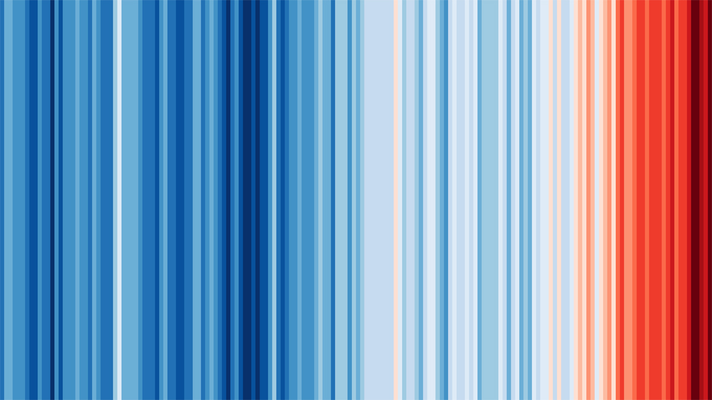{fig-align="center" width="80%"}

::: aside
Source: [The Global Warming Stripes by Ed Hawkins](https://ed-hawkins.github.io/climate-visuals/stripes.html)
:::

## {background-iframe="https://www.youtube.com/embed/3VIHRLUnVOI?autoplay=1" background-interactive="true"}

## {.center}

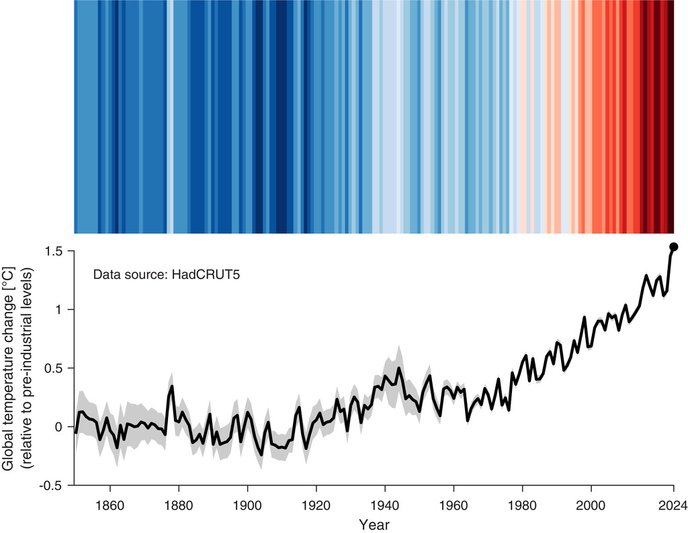

::: footer
https://doi.org/10.1175/BAMS-D-24-0212.1
:::

## {data-background-image="images/climate-stripes_showcase.png" data-background-size="cover"}

::: footer
https://showyourstripes.info/showcase
:::

## Make it personal.

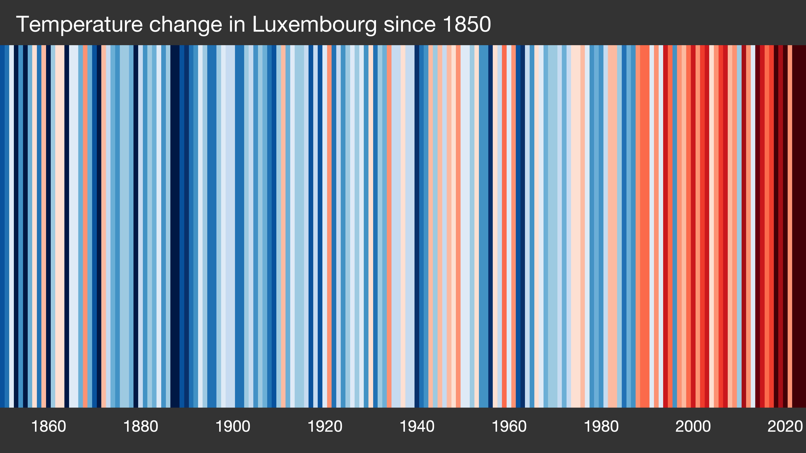{fig-align="center" width="80%"}

::: aside
[Show Your Stripes - Luxembourg](https://showyourstripes.info/l/europe/luxembourg/luxembourg)
:::

# The purpose of this course

## {.center}

::: {.nonincremental}
::: {.fragment}
**Effective data visualization matters!**
:::

::: {.fragment}
It's not about programming or using a specific tool.
:::

::: {.fragment}
It's about *Designing* Effective Data Visualizations.
:::
:::
 

## Resources

  
  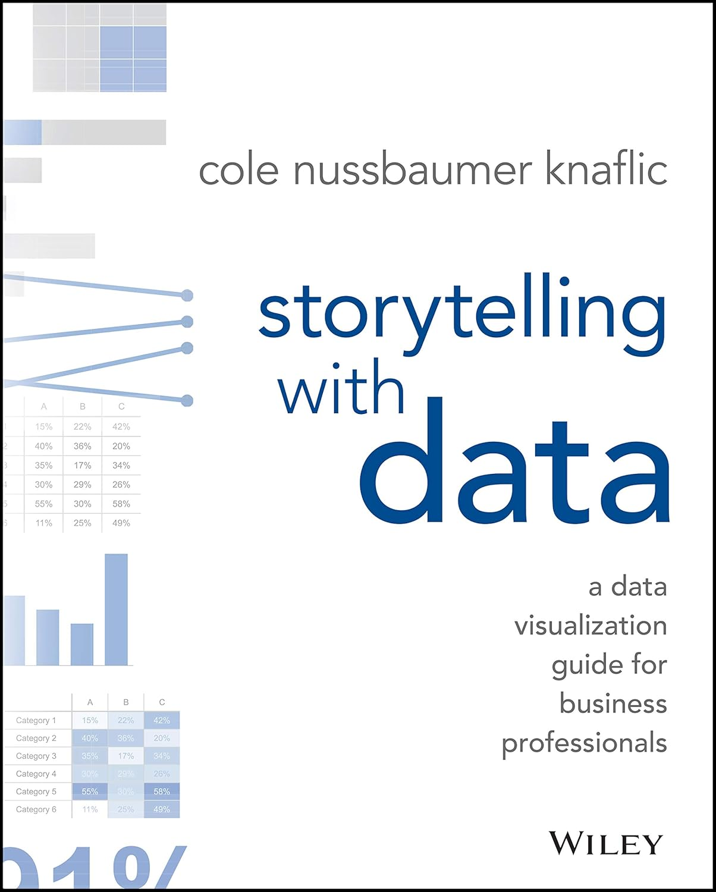
  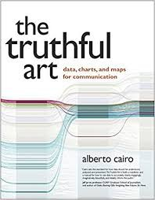

::: notes
https://www.storytellingwithdata.com/books
:::

# Assignment

1.  Look for (open access) articles in your field of interest
2.  Find 2 figures that you **like**
3.  Find 2 figures that you **don't like** (all from different papers)
4.  Explain briefly for each figure why you like/dislike it
5.  Upload your document on Moodle
   - one page per figure + your comment
   - name the file using your `<lastname>_graph_selection.pdf` pattern

