## How to assess if a data visualization is good or not?

Different people have different criteria

-   The truthful art
-   [Ten simple rules for better figures (Plos Computational Biology)](https://journals.plos.org/ploscompbiol/article?id=10.1371/journal.pcbi.1003833)
-   My own 10 rules (WIP)
-   Create your own

::: notes
Making data visualizations is part objective part subjective, part science part art. There are things that are clearly wrong (for a given purpose); but there are also preferences.
:::

## My checklist

:::: {.columns}

::: {.column width="50%"}
1.  Good data
2.  Honest representation
3.  Completeness
4.  Purposeful (message)
5.  Meaning and Context
:::

::: {.column width="50%"}
6.  Accessible
7.  Intuitive
8.  Effective
9.  Efficient
10. Ergonomic
:::

::::

# #1 Good data {background-color="#849ba5"}

## #1 Good data
-   "Garbage in, garbage out" 
-   Only use data from trustworthy sources, collected using valid methods
-   Know your data: 
    -   provenance
    -   limitations 
    -   measurement details
    -   licence

::: footer
#1 Good data
::: 

## {.center}

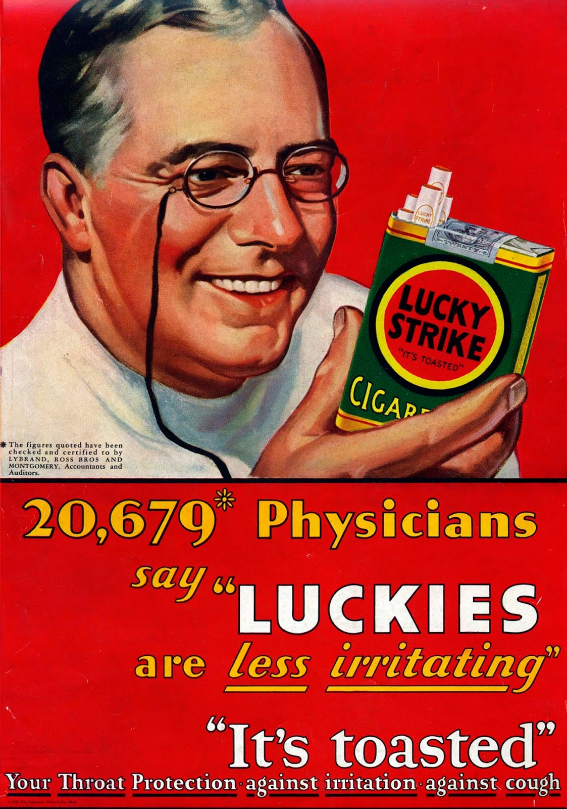{.img-shadow width="70%" fig-align="center"}

[Source: https://rarehistoricalphotos.com](https://rarehistoricalphotos.com/doctors-smoking-cigarette-1930-1950/){style="font-size: 0.8em; color: #666; display: block; text-align: center; margin-top: 20px;"}

::: notes

reputation, moral and professional responsibility

:::

::: footer
#1 Good data
::: 

# #2: Honest representation {background-color="#849ba5"}

## #2: Honest representation

-   Avoid mistakes when mapping data to graph attributes
-   Do not cherry-pick data and ignore *relevant* data
-   Use common scales across figures/panels
-   Use appropriate scaling
-   Indicate missing values and uncertainty
-   Avoid creating false patterns (e.g., using non-linear mappings).
-   (some "mistakes" are intentional)

::: footer
#2  Honest representation
::: 

## {.center}

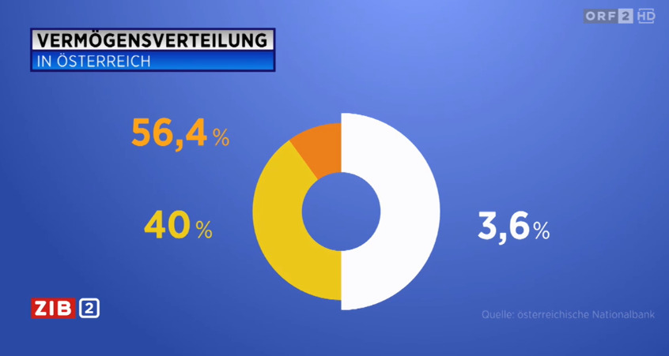{.img-shadow width="60%" fig-align="center"}

[Source: https://viz.wtf](https://viz.wtf/image/633515263030116352){style="font-size: 0.8em; color: #666; display: block; text-align: center; margin-top: 20px;"}

::: footer
#2  Honest representation
::: 

## {.center}

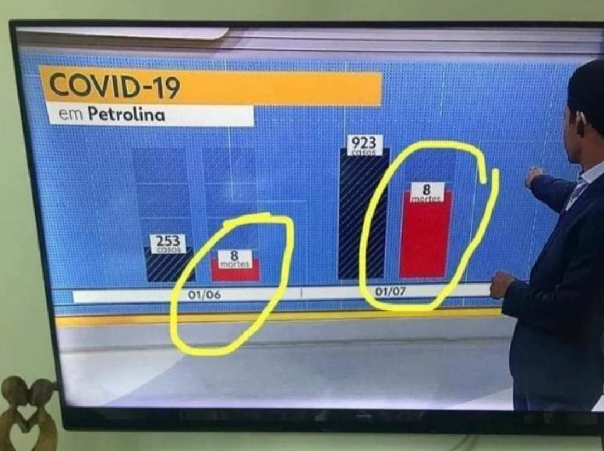{.img-shadow width="60%" fig-align="center"}

[Source: https://viz.wtf](https://viz.wtf/image/625633360933453824){style="font-size: 0.8em; color: #666; display: block; text-align: center; margin-top: 20px;"}

::: footer
#2  Honest representation
::: 

## {.center}

{.img-shadow width="60%" fig-align="center"}

[Source: https://viz.wtf](https://viz.wtf/image/658882425666011136){style="font-size: 0.8em; color: #666; display: block; text-align: center; margin-top: 20px;"}

::: footer
#2  Honest representation
::: 

## {.center}

{.img-shadow width="60%" fig-align="center"}

[Source: https://viz.wtf](https://viz.wtf/image/643484719208677376){style="font-size: 0.8em; color: #666; display: block; text-align: center; margin-top: 20px;"}

::: footer
#2  Honest representation
::: 

## {.center}

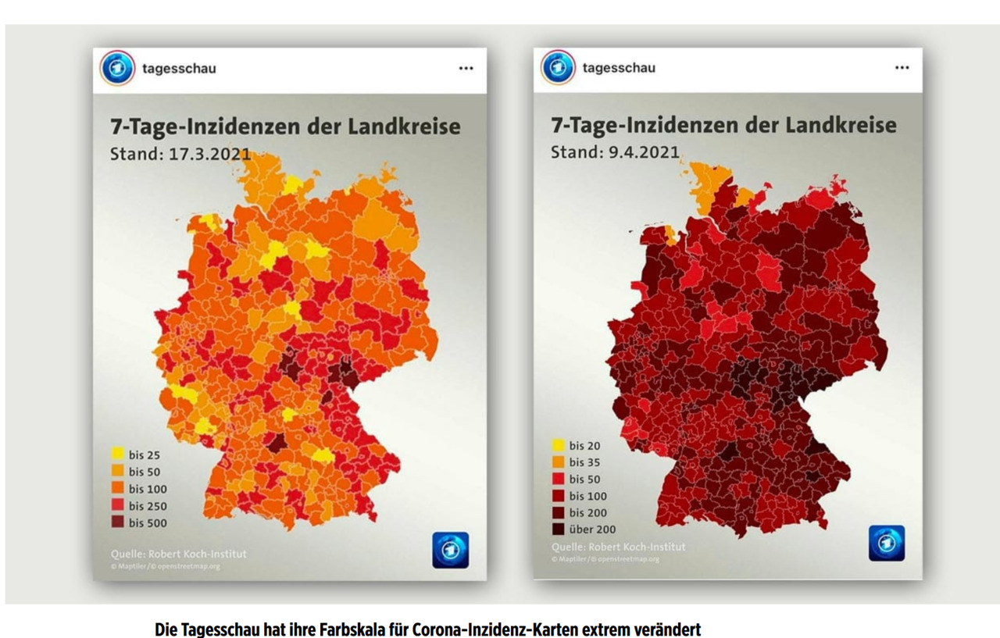{.img-shadow width="60%" fig-align="center"}

[Source: https://viz.wtf](https://viz.wtf/image/648282602475798528){style="font-size: 0.8em; color: #666; display: block; text-align: center; margin-top: 20px;"}

::: footer
#2  Honest representation
::: 

<!-- TODO: Find example of misinterpretations due to zooming -->

## Avoid distortions

This is a complex topic...

## 

::: {style="display: flex; align-items: center; justify-content: center; height: 70vh;"}
$$\text{Lie Factor} = \frac{\text{size of effect in the visual}}{\text{size of the effect in the data}}$$
:::

## The Lie factor

{.img-shadow width="60%" fig-align="center"}

[Source: https://statsthinking21.github.io/](https://statsthinking21.github.io/statsthinking21-core-site/data-visualization.html){style="font-size: 0.8em; color: #666; display: block; text-align: center; margin-top: 20px;"}

## But...

:::: {.columns}

::: {.column width="50%" .fragment}
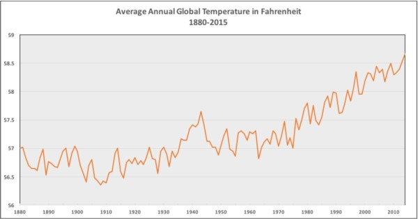{.img-shadow height="400px"}
:::

::: {.column width="50%" .fragment}
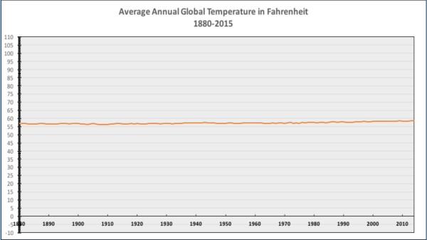{.img-shadow height="400px"}
:::

::::

[Source: https://www.powerlineblog.com/](https://www.powerlineblog.com/archives/2015/10/the-only-global-warming-chart-you-need-from-now-on.php){style="font-size: 0.8em; color: #666; display: block; text-align: center; margin-top: 20px;"}

<!-- 
https://www.powerlineblog.com/archives/2015/10/the-only-global-warming-chart-you-need-from-now-on.php
redo the figures in the future 
https://data.giss.nasa.gov/gistemp/tabledata_v3/GLB.Ts.txt
-->

<!--
##

Misleading graphs:
https://www.statisticshowto.com/probability-and-statistics/descriptive-statistics/misleading-graphs/

use the appropriate baseline, not necessarily always 0
https://nightingaledvs.com/the-lie-factor-and-the-baseline-paradox/

quote from here:
In general, in a time series, use a baseline that shows the data, not the zero point. […] don’t spend a lot of empty vertical space trying to reach down to the zero point at the cost of hiding what is going on in the data line itself.— Edward Tufte

use inset to show the broader context
example from plos biology

https://www.researchgate.net/publication/361285094_A_Graph_Neural_Network-Based_Map_Tiles_Extraction_Method_Considering_POIs_Priority_Visualization_on_Web_Map_Zoom_Dimension/figures?lo=1

::: footer
#2  Honest representation
::: 
-->

## {.center}

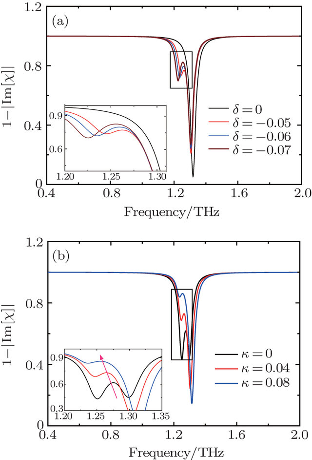{.img-shadow width="60%" fig-align="center"}

[Source: Xiu-Yun et al. (2016)](https://www.researchgate.net/publication/302066027_Origin_of_strain-induced_resonances_in_flexible_terahertz_metamaterials/figures?lo=1){style="font-size: 0.8em; color: #666; display: block; text-align: center; margin-top: 20px;"}

::: footer
#2  Honest representation
::: 

# #3 — Completeness {background-color="#849ba5"}

## #3 — Completeness

Graphs must be self-contained (i.e., show everything that is necessary for the viewer to "get" the message).

This means, show the viewer:

 - what x and y labels, legend, units, colors mean 
 - some indication of the uncertainty in the data
 - what data sources were used (when applicable)
 - what the message / point of that graph is (titles, annotations)
 - what "to do" with the graph to get the message 

::: footer
#3 Completeness
::: 

## {.center}

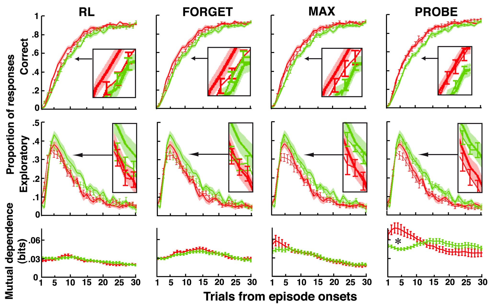{.img-shadow width="60%" fig-align="center"}

[Source: Collins & Koechlin (2012)](https://journals.plos.org/plosbiology/article?id=10.1371/journal.pbio.1001293){style="font-size: 0.8em; color: #666; display: block; text-align: center; margin-top: 20px;"}

::: footer
#3 Completeness
::: 

## {.center}

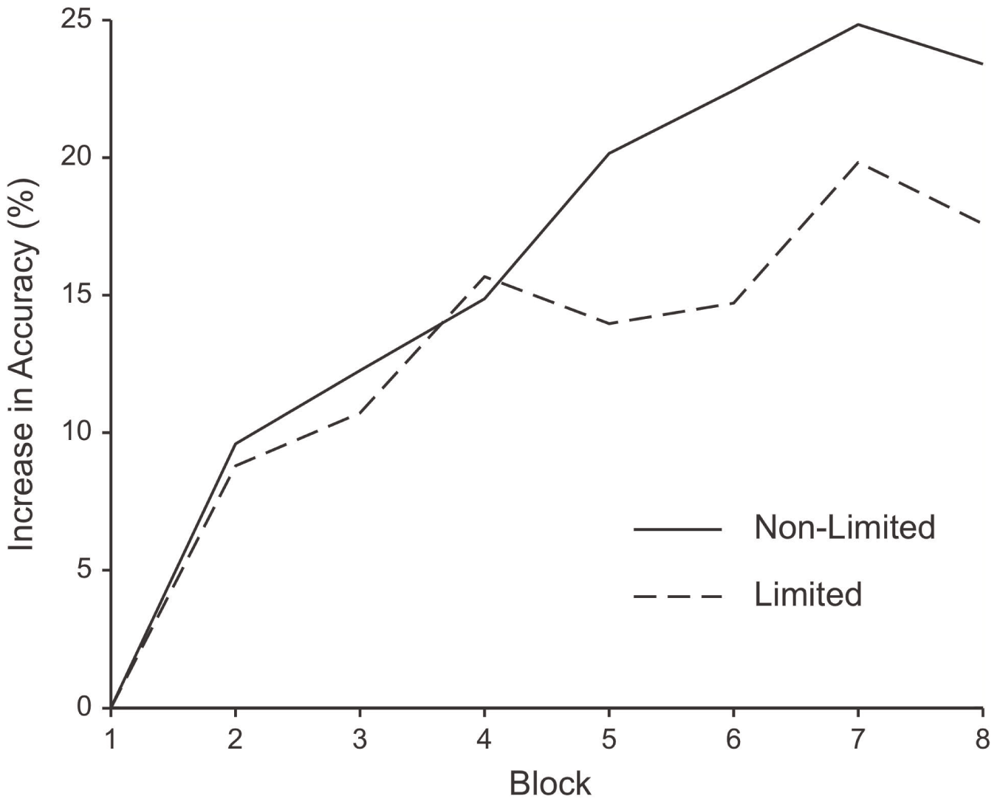{.img-shadow width="60%" fig-align="center"}

[Source: Miller et al. (2012)](https://journals.plos.org/plosone/article?id=10.1371/journal.pone.0038680){style="font-size: 0.8em; color: #666; display: block; text-align: center; margin-top: 20px;"}

::: footer
#3 Completeness
::: 

<!--
missing x or y axis

missing context: I see y as a function of x, what is this about?
-->

::: footer
#3 Completeness
::: 

# #4 — Purpose / Message {background-color="#849ba5"}

## #4 — Purpose / Message

-   Each figure should have a clear message; 
-   Ideally, that message is interesting and relevant;
-   This message should be the title of the figure.

::: footer
#4 Purpose / Message
::: 

## {.center}

Fig 1. Mean percentage of correct answers (panel a) and mean reaction times in correct trials (panel b) as a function of training session (S1, S2, S3, S4, S5) and group (younger adults, older adults). Bars indicate the standard error of the mean.

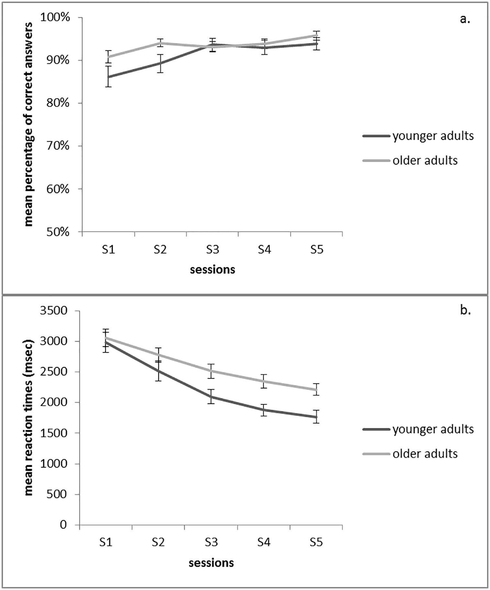{.img-shadow width="60%" fig-align="center"}

[Source: https://journals.plos.org](https://journals.plos.org/plosone/article?id=10.1371/journal.pone.0193529){style="font-size: 0.8em; color: #666; display: block; text-align: center; margin-top: 20px;"}

::: footer
#4 Purpose / Message
::: 

<!--
## {.center}

[See example at European Parliament](https://www.europarl.europa.eu/topics/en/article/20190313STO31218/co2-emissions-from-cars-facts-and-figures-infographics){style="font-size: 1em; display: block; text-align: center;"}

::: footer
#4 Purpose / Message
::: 
-->

## {.center}

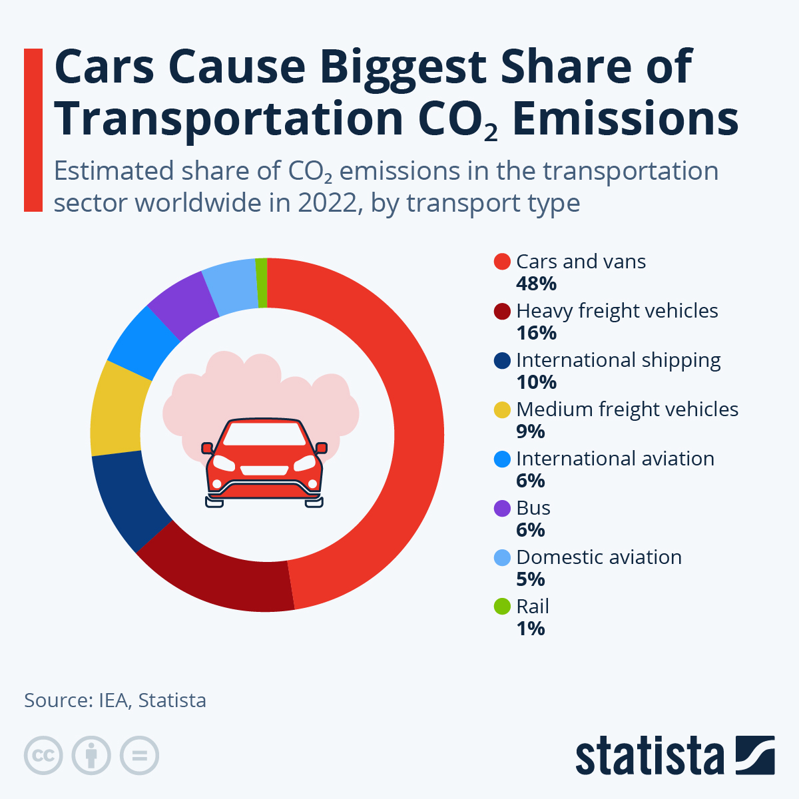{.img-shadow width="60%" fig-align="center"}

[Source: https://www.statista.com](https://www.statista.com/chart/30890/estimated-share-of-co2-emissions-in-the-transportation-sector/){style="font-size: 0.8em; color: #666; display: block; text-align: center; margin-top: 20px;"}

::: footer
#4 Purpose / Message
::: 

## {.center}

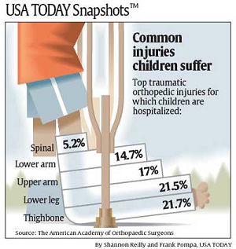{.img-shadow width="60%" fig-align="center"}

[Source: https://www.statisticshowto.com](https://www.statisticshowto.com/probability-and-statistics/descriptive-statistics/misleading-graphs/){style="font-size: 0.8em; color: #666; display: block; text-align: center; margin-top: 20px;"}

::: footer
#4 Purpose / Message
::: 

# Rule 5 — Meaning / Context {background-color="#849ba5"}

## Rule 5 — Meaning / Context

- Provide additional information (i.e., not directly included in the data) for people to understand the figure (meaning) and get a sense of the relevance or importance of the message (context). 

- This can be done by:
  - reference points or curves
  - labelled regions or boundaries
  - annotations
  - illustrations, diagrams

::: footer
#5 Meaning / Context
::: 

## {.center}

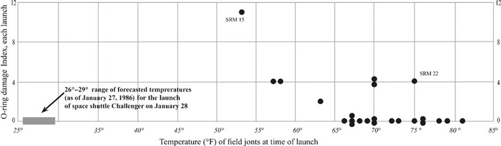{.img-shadow width="60%" fig-align="center"}

::: footer
#5 Meaning / Context
::: 

## {.center}

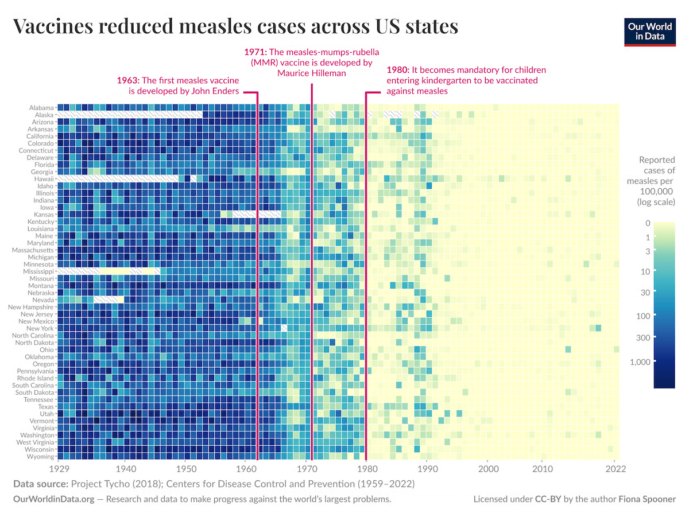{.img-shadow width="60%" fig-align="center"}

[Source: https://www.anychart.com](https://www.anychart.com/blog/2025/05/23/data-visual-insight/){style="font-size: 0.8em; color: #666; display: block; text-align: center; margin-top: 20px;"}

::: notes
https://graphics.wsj.com/infectious-diseases-and-vaccines/
:::

::: footer
#5 Meaning / Context
::: 

## {.center}

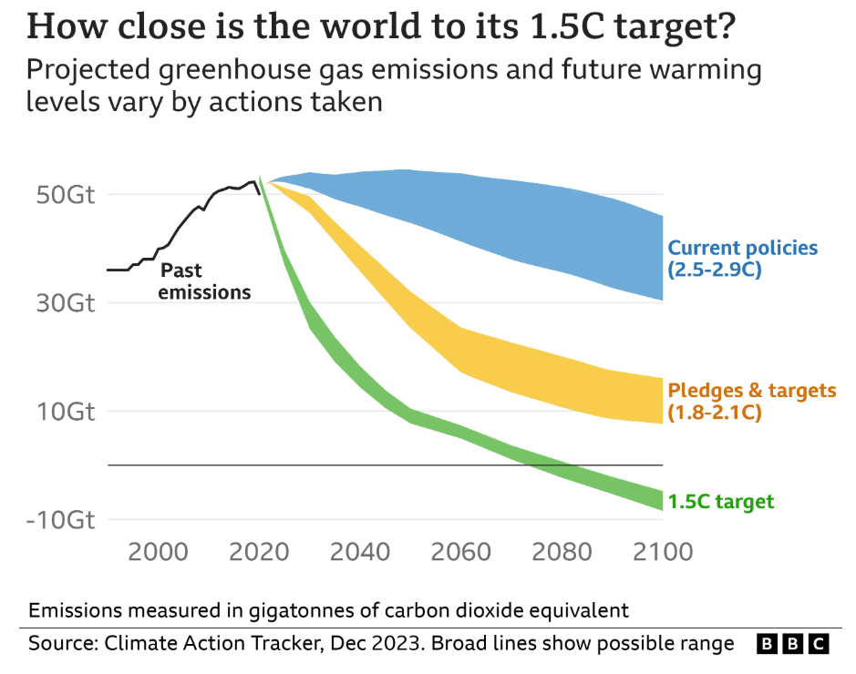{.img-shadow width="60%" fig-align="center"}

[Source: https://www.bbc.com](https://www.bbc.com/news/science-environment-65754296){style="font-size: 1em; display: block; text-align: center;"}

::: footer
#5 Meaning / Context
::: 

## {.center}

Figure 2. Learning was facilitated and predicted by previous learning of a similar task and very-long delay (VLD) conditioning was easier to learn than trace conditioning.

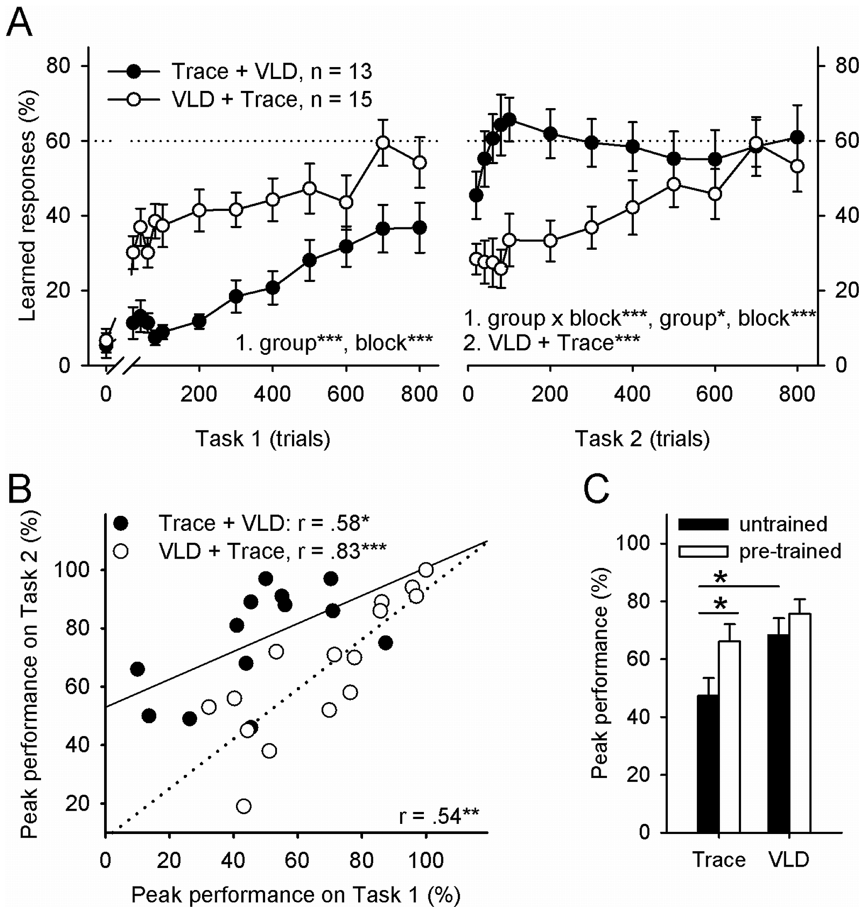{.img-shadow width="60%" fig-align="center"}

[Source: Nokia et al. (2012)](https://journals.plos.org/plosone/article?id=10.1371/journal.pone.0031375){style="font-size: 1em; display: block; text-align: center;"}

::: footer
#5 Meaning / Context
::: 

<!--
has great message but link to figure is unclear
https://journals.plos.org/plosone/article?id=10.1371/journal.pone.0031375

Figure 2. Learning was facilitated and predicted by previous learning of a similar task and very-long delay (VLD) conditioning was easier to learn than trace conditioning.
In A learned responding is plotted in bins of 20 trials for the first 100 trials of each task and in bins of 100 trials from there on. The conditioned stimulus did not elicit eyeblinks before conditioning (Task 1 at 0). Learned responding increased during the initial training experience (Task 1), with elevated responding in animals trained with VLD conditioning compared to the group trained in trace conditioning. During training on the second task (Task 2), animals initially trained with the trace procedure rapidly acquired the VLD conditioned response whereas those initially trained with VLD required more trials to learn to time the conditioned response during the trace interval. Both groups learned to respond adaptively by the end of training (Task 2 at 800). B) Animals that learned well during the first task learned well during training on the second, related task. C) The highest percentage of learned responses attained during any given 100-trial block (Peak performance %) in the first phase of training (untrained) was significantly higher as a consequence of VLD than trace conditioning. When training was preceded by training on a similar task (pre-trained), the rats learned equally well both during VLD and trace conditioning. In A, statistically significant results of two-factor repeated measures ANOVAs are indicated (1.). If an interaction was detected, a separate ANOVA for each level was conducted (2.). Asterisks refer to statistical significance: * p<.05, ** p<.01, *** p<.001.    show less
-->

# #6 — Accessible {background-color="#849ba5"}

## #6 — Accessible

Make figures that are adequate for most humans

-   Ensure size, form, and contrast are adequate for human viewers.
-   Consider color blindness and the medium; 
-   Avoid overplotting.

::: footer
#6 Accessible
::: 

##  {.center}

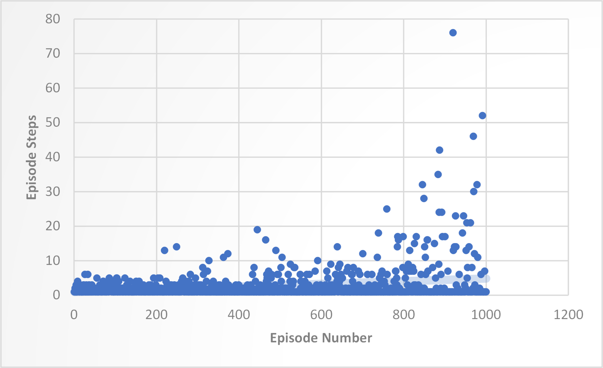{.img-shadow width="60%" fig-align="center"}

[Fig 3. Training Performance of DQN Agent with 1000 Episodes and Episode Steps. Cyber security Enhancements with reinforcement learning: A zero-day vulnerability identification perspective. Naeem et al. (2025) — Source: https://journals.plos.org](https://journals.plos.org/plosone/article?id=10.1371/journal.pone.0324595){style="font-size: 0.8em; color: #666; display: block; text-align: center; margin-top: 20px;"}

::: footer
#6 Accessible
::: 

##  {.center}

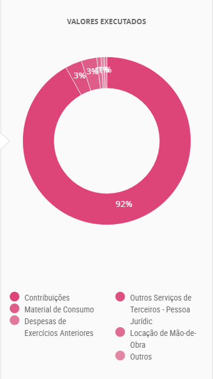{.img-shadow width="60%" fig-align="center"}

[Source: Portal da Transparência / https://viz.wtf](https://portaldatransparencia.gov.br/funcoes/10-saude?ano=2021){style="font-size: 0.8em; color: #666; display: block; text-align: center; margin-top: 20px;"}

::: footer
#6 Accessible
::: 

##  {.center}

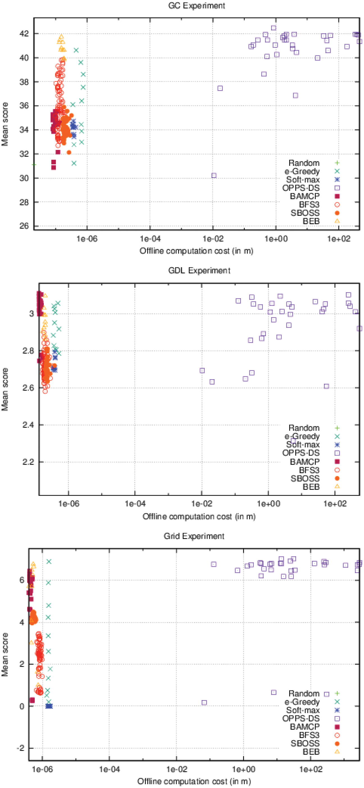{.img-shadow width="60%" fig-align="center"}

[Fig 6. Offline computation cost Vs. Performance (accurate case). Castronovo et al. (2016) — Source: https://journals.plos.org](https://journals.plos.org/plosone/article?id=10.1371/journal.pone.0157088){style="font-size: 0.8em; color: #666; display: block; text-align: center; margin-top: 20px;"}

::: footer
#6 Accessible
::: 

# #7 — Intuitive / Conventional {background-color="#849ba5"}

## #7 — Intuitive / Conventional

People have expectations and make assumptions.
Violating those assumptions can mislead people.
Show images to clarify topic

Example of common conventions: 

-   increases go up
-   green is positive
-   reading top-down, left-right

::: footer
#7 Intuitive / Conventional
::: 

## {.center}

{.img-shadow width="60%" fig-align="center"}

[Source: https://visualisingdata.com](https://visualisingdata.com/2014/11/just-can-map-data/){style="font-size: 0.8em; color: #666; display: block; text-align: center; margin-top: 20px;"}

::: footer
#7 Intuitive / Conventional
::: 

## {.center}

{.img-shadow width="60%" fig-align="center"}

[Source: https://github.com/z3tt/TidyTuesday](https://raw.githubusercontent.com/z3tt/TidyTuesday/main/plots/2020_31/2020_31_PalmerPenguins.png){style="font-size: 0.8em; color: #666; display: block; text-align: center; margin-top: 20px;"}

::: footer
#7 Intuitive / Conventional
::: 

## {.center}

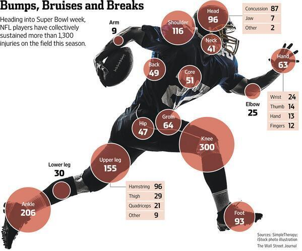{.img-shadow width="60%" fig-align="center"}

::: footer
#7 Intuitive / Conventional
::: 

## {.center}

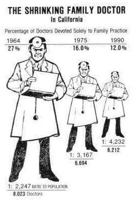{.img-shadow width="60%" fig-align="center"}

[Source: Tufte (1991)](https://infovis-wiki.net/wiki/Lie_Factor){style="font-size: 0.8em; color: #666; display: block; text-align: center; margin-top: 20px;"}

::: footer
#7 Intuitive / Conventional
::: 

## {.center}

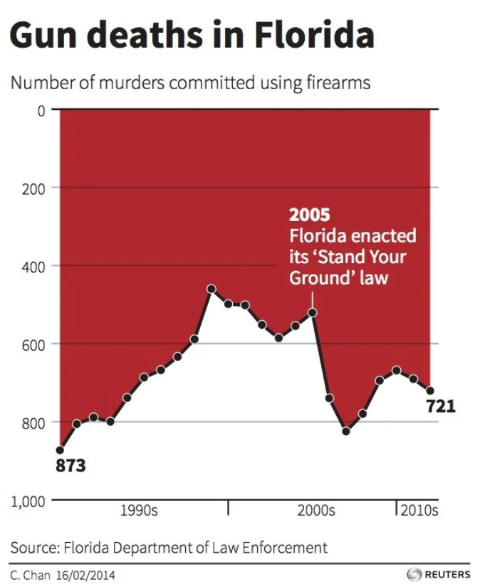{.img-shadow width="60%" fig-align="center"}

::: notes
also discussed here: https://mdsr-book.github.io/mdsr3e/08-ethics.html
:::

::: footer
#7 Intuitive / Conventional
::: 

## {.center}

{.img-shadow width="60%" fig-align="center"}

[Source: https://viz.wtf](https://viz.wtf/image/658882425666011136){style="font-size: 0.8em; color: #666; display: block; text-align: center; margin-top: 20px;"}

::: footer
#7 Intuitive / Conventional
::: 

## Conventions may be audience specific! 

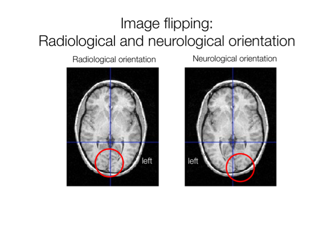{.img-shadow width="60%" fig-align="center"}

[Source: Wager and Lindquist (2015) Principles of fMRI](https://leanpub.com/principlesoffmri/read){style="font-size: 0.8em; color: #666; display: block; text-align: center; margin-top: 20px;"}

# #8 — Effective {background-color="#849ba5"}

## #8 — Effective

By effective I mean visual representation that are optimized for human perception and structurally adequate to support its message. 

- use the correct type of visualization
- map the data to aesthetics following the laws of human perception

::: notes
some representations are perceived more accurately than others
some types of relationships are better conveyed by some types of representations;
:::

::: footer
#8 Effective
::: 

## {.center}

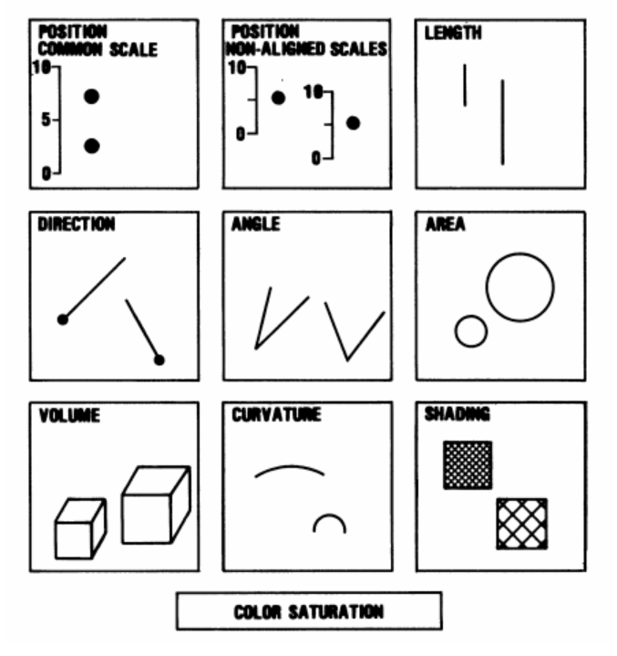{.img-shadow width="60%" fig-align="center"}

[Source: Cleveland and McGill (1984)](https://www.tandfonline.com/doi/abs/10.1080/01621459.1984.10478080){style="font-size: 0.8em; color: #666; display: block; text-align: center; margin-top: 20px;"}

<!--
Cleveland, William; McGill, Robert (1984). "Graphical Perception: Theory, Experimentation, and Application to the Development of Graphical Methods". Journal of the American Statistical Association. 79 (387): 531–544. doi:10.1080/01621459.1984.10478080. JSTOR 2288400
-->

::: footer
#8 Effective
::: 

::: notes 
I will cover this more in a future session.
::: 

## {.center}

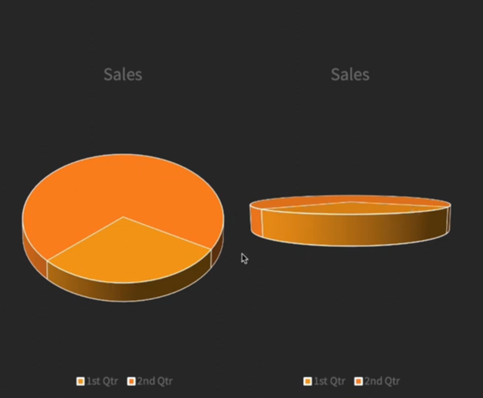{.img-shadow width="60%" fig-align="center"}

[3D pie chart example]{style="font-size: 0.8em; color: #666; display: block; text-align: center; margin-top: 20px;"}

::: footer
#8 Effective
::: 

## {.center}

<iframe src="https://datavizproject.com" width="100%" height="700px" style="border: 2px solid #ccc;"></iframe>

::: footer
#8 Effective
::: 

## {.center}

<iframe src="https://r-graph-gallery.com/" width="100%" height="700px" style="border: 2px solid #ccc;"></iframe>

::: footer
#8 Effective
::: 

<!--
 - datavizcatalogue.com
 - datavizproject.com
 - r-graph-gallery.com
 - https://ft-interactive.github.io/visual-vocabulary/
-->

## {.center}

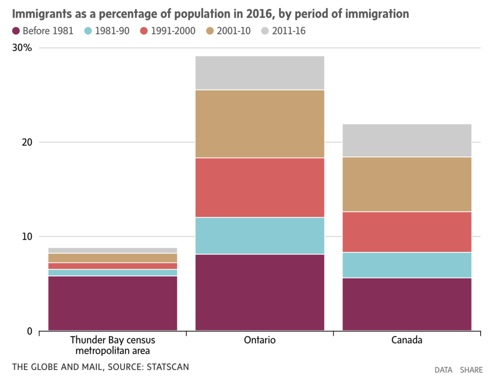{.img-shadow width="60%" fig-align="center"}

[Source: https://viz.wtf](https://viz.wtf/image/187558414596){style="font-size: 0.8em; color: #666; display: block; text-align: center; margin-top: 20px;"}

::: footer
#8 Effective
::: 

# #9 — Efficient {background-color="#849ba5"}

## #9 — Efficient

-   Every element should serve a purpose. 
-   Remove clutter and unnecessary decoration.
-   Aim for simplicity while remaining truthful to the data.

::: footer
#9 Efficient
::: 

## {.center}

{.img-shadow width="60%" fig-align="center"}

::: footer
#9 Efficient
::: 

## {.center}

{.img-shadow width="60%" fig-align="center"}

::: footer
#9 Efficient
::: 

## Data/Ink ratio (chart junk)

::: {style="display: flex; align-items: center; justify-content: center; height: 70vh;"}
$$\text{Data-ink ratio} = \frac{\text{ink used to display data}}{\text{total ink used in visualization}}$$
:::

::: footer
#9 Efficient
:::

## {.center}

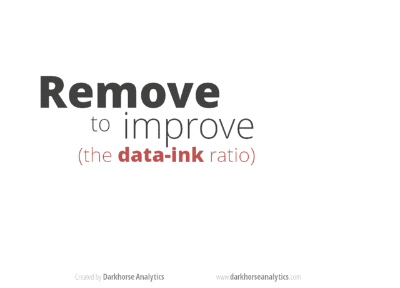{.img-shadow width="60%" fig-align="center"}

<!--https://image.uisdc.com/wp-content/uploads/2013/09/Less-More.gif-->

::: footer
#9 Efficient
:::

# #10 — Ergonomic {background-color="#849ba5"}

## #10 — Ergonomic
Minimize effort: the elements in the figure should be organized to minimize effort (e.g., eye movements, searching, memorizing):

- put elements where they are needed
- add lines/references to facilitate reading and comparing
- put things that are to be compared close to each other
- be consistent (e.g., colors always mean the same thing)

Guide attention trajectory: The elements in the figure are organized in a way that make it clear to the reader in what order they should be processed.

::: footer
#10 Ergonomic
::: 

## {.center}

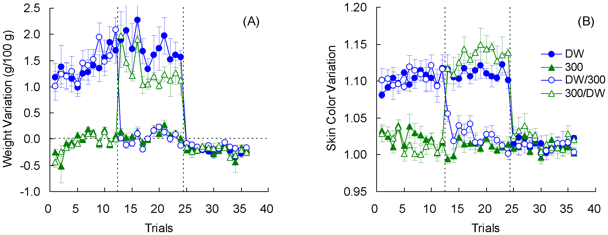{.img-shadow width="60%" fig-align="center"}

[Figure 4. Weight variation (panel A) and Skin color variation (panel B) in Experiment 2. Means ± standard errors (alpha = 0.05) are plotted. Muzio et al. (2011) — Source: https://journals.plos.org](https://journals.plos.org/plosone/article?id=10.1371/journal.pone.0025798){style="font-size: 0.8em; color: #666; display: block; text-align: center; margin-top: 20px;"}

::: footer
#10 Ergonomic
:::

## {.center}

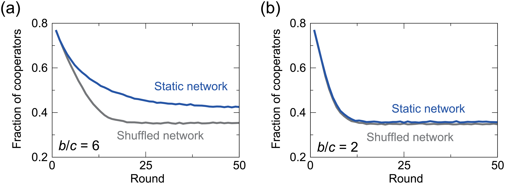{.img-shadow width="60%" fig-align="center"}

[Ezaki & Masuda (2017) — Source: https://journals.plos.org](https://journals.plos.org/plosone/article?id=10.1371/journal.pone.0189220){style="font-size: 0.8em; color: #666; display: block; text-align: center; margin-top: 20px;"}

::: footer
#10 Ergonomic
:::

## {.center}

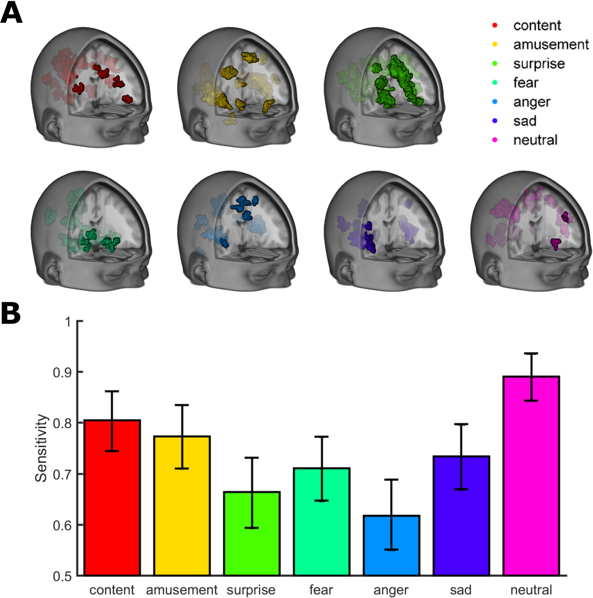{.img-shadow width="60%" fig-align="center"}

[Gasque (2016) — Source: https://journals.plos.org](https://journals.plos.org/plosbiology/article?id=10.1371/journal.pbio.2001633){style="font-size: 0.8em; color: #666; display: block; text-align: center; margin-top: 20px;"}

::: footer
#10 Ergonomic
:::

## {.center}

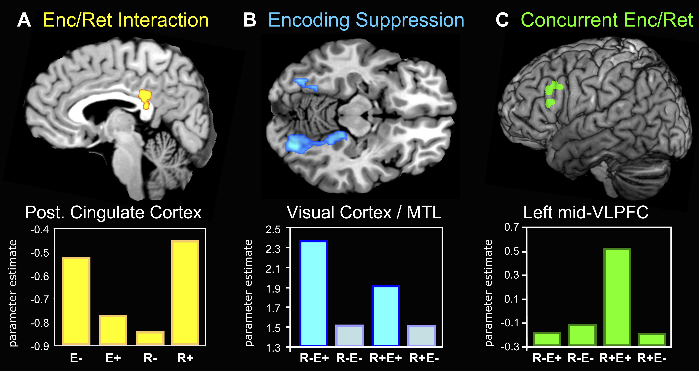{.img-shadow width="60%" fig-align="center"}

[Figure 3. fMRI Results. Hujibers et al. (2009) — Source: https://journals.plos.org](https://journals.plos.org/plosbiology/article?id=10.1371/journal.pbio.1000011){style="font-size: 0.8em; color: #666; display: block; text-align: center; margin-top: 20px;"}

::: footer
#10 Ergonomic
::: 

<!--
For the purpose of illustration, all activations are shown at p < 0.005. (A) Interaction between stage (E/R) and outcome (+/-) in PCC, E– = (R–E– and R+E–), E+ = (R–E+ and R+E+), R– = (R–E– and R–E+), R+ = (R+E– and R+E+). (B) A thre-step analysis indicated encoding suppression in the visual cortex and medial temporal lobe during concurrent retrieval. In step 1, a “localizer” task identified regions related to scene processing. In step 2, we defined encoding success areas within the remaining regions using the contrast R–E+ > R–E–. In step 3, we tested whether the mean encoding success activity of the remaining regions was reduced when successful retrieval happened concurrently. (C) Greater activity in left mid-VLPFC during concurrent, as compared to separate, successful encoding and retrieval (R+E+ > R+E– and R–E+). Bar graphs indicate the mean of all activated voxels (p < 0.001, uncorrected).    show less

-->

## Recap {.center}

:::: {.columns}

::: {.column width="50%"}
1.  Good data
2.  Honest representation
3.  Completeness
4.  Purposeful (message)
5.  Meaning and Context
:::

::: {.column width="50%"}
6.  Accessible
7.  Intuitive
8.  Effective
9.  Efficient
10. Ergonomic
:::

::::

## Questions? Comments? {.center}

# Your turn {background-color="#849ba5"}

Review the 4 images you selected last time.

Comment each of them along the 10 dimensions we just covered

