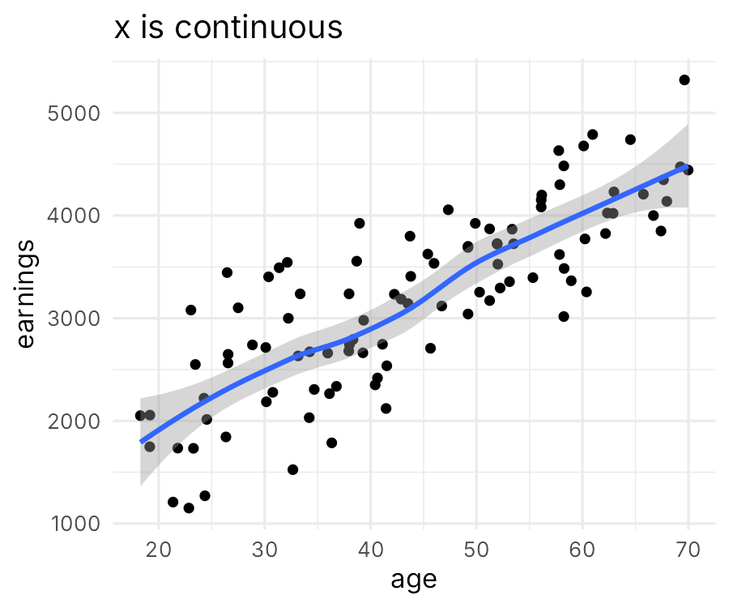
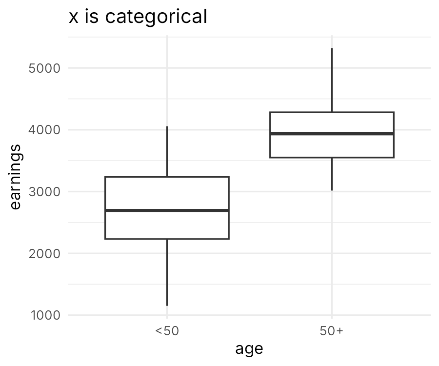
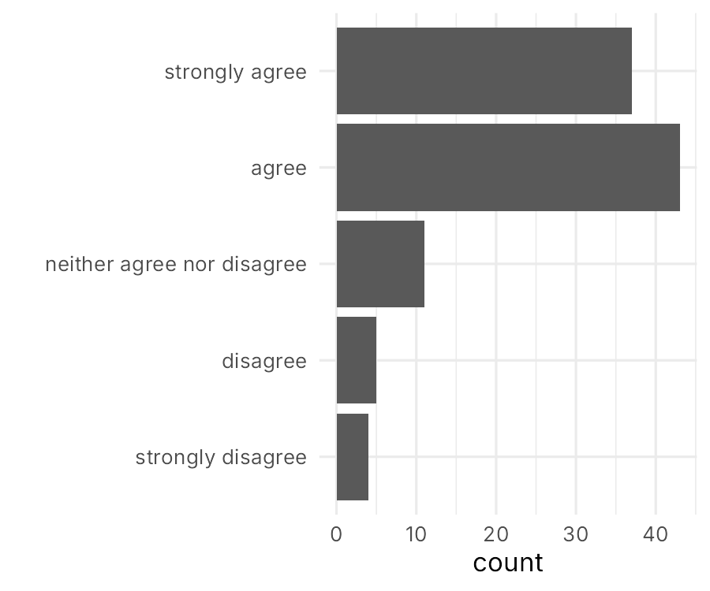
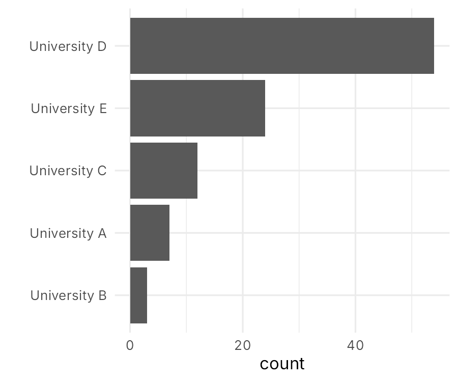
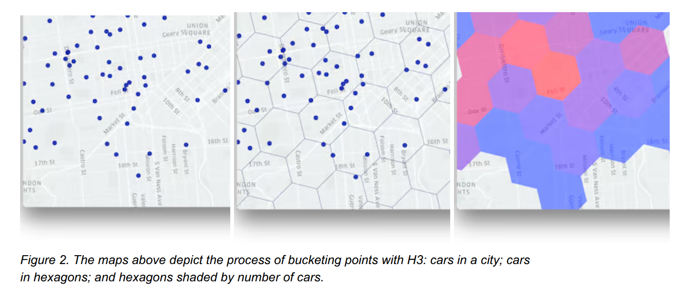
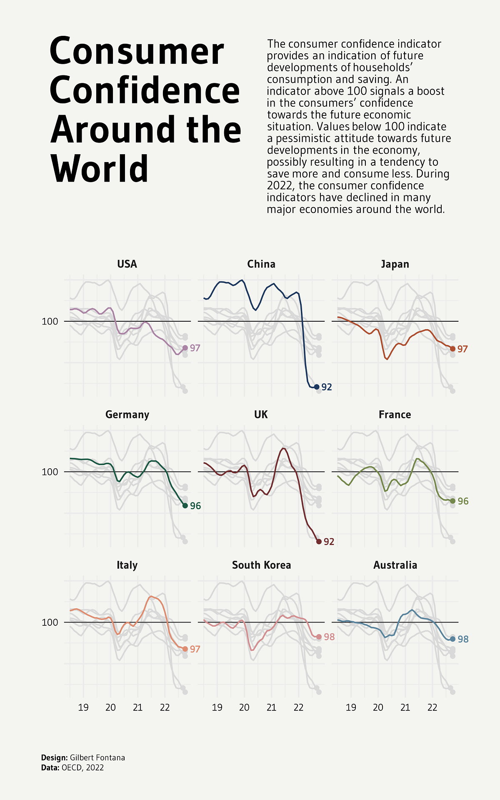
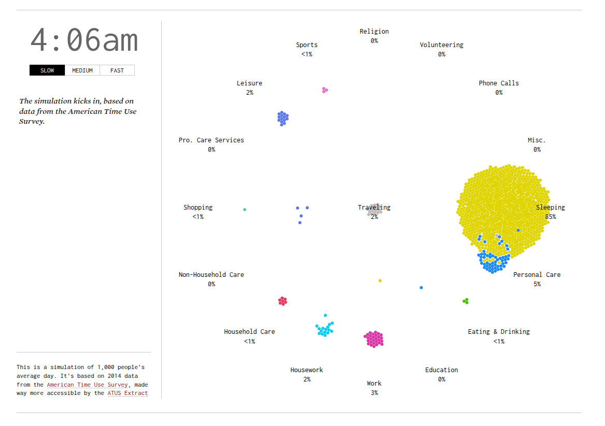

##  {data-background-image="images/climate-stripes.jpg" data-background-size="cover"}

::::: {style="text-align: left; position: absolute; bottom: 150px; left: 50px;"}
::: {style="background-color: rgba(245, 42, 42, 0.88); color: white; padding: 30px 40px; display: inline-block; margin-bottom: 20px;"}
<h2 style="margin: 0; color: white;">
Picking the right type of data visualization
</h2>
:::

::: {style="background-color: rgba(6, 23, 99, 0.9); color: white; padding: 15px 25px; display: inline-block;"}
<p style="margin: 0; font-size: 1em;">
Pedro Cardoso-Leite
</p>
<p style="margin: 0; font-size: 0.7em;">
<a href="mailto:pedro.cardosoleite@uni.lu" style="color: white;">pedro.cardosoleite@uni.lu</a>
</p>
:::
:::::

::: {.footer style="color: white !important; text-shadow: 1px 1px 3px rgba(0, 0, 0, 0.8);"}
<a href="https://ed-hawkins.github.io/climate-visuals/stripes.html" style="color: white !important; text-shadow: 1px 1px 3px rgba(0, 0, 0, 0.8);">The Global Warming Stripes by Ed Hawkins.</a>
:::

# How to choose a graph type? {background-color="#849ba5"}

## {.center}

::: {.fragment}
There are many ways to visualize data
:::

::: {.fragment}
You need to know some classics
:::

::: {.fragment}
A principled approach leads to better choices
:::


# Typologies of<br>Data Visualizations {background-color="#849ba5"}

## Classification strategies {.center}

::: {.fragment}

*what structure in the data do you want to show?* 

*what cognitive operations do you want your users to apply on the visualization?*
:::

<br>


::: {.fragment}
*what kind of data do you have?*
:::

<br>

::: {.fragment}
Other considerations
:::


::: notes
Often both approaches are used together
:::


## {.center}

::: {.fragment}
There's no algorithm to determine the "best" solution
::: 

::: {.fragment}
You need to jointly consider many criteria
::: 


::: {.fragment}
You need to think for yourself and make choices
::: 


::: notes

but you can often say which of two versions is better

:::


# Classification<br>by Analytic Purpose {background-color="#849ba5"}

## What is analytic purpose?

- *What structure in the data do you want to show?*
- *What cognitive operations do you want users to apply?*


::: notes
There is no single agreed-upon categorization. 

Different authors propose different systems, but there is large overlap.
:::


## {.center}

<iframe src="https://ft-interactive.github.io/visual-vocabulary/" width="100%" height="800px" style="border: 2px solid #ccc;"></iframe>

::: footer
[FT Visual Vocabulary](https://ft-interactive.github.io/visual-vocabulary/)
:::


## {.center}

<iframe src="https://r-graph-gallery.com" width="100%" height="700px" style="border: 2px solid #ccc;"></iframe>

::: footer
[r-graph-gallery.com](https://r-graph-gallery.com)
:::


## {.center}

<iframe src="https://python-graph-gallery.com" width="100%" height="700px" style="border: 2px solid #ccc;"></iframe>

::: footer
[https://python-graph-gallery.com](https://python-graph-gallery.com)
:::


# Classification<br>by Data Type {background-color="#849ba5"}


## The type of data you have<br>is a major determinant<br>of data visualization choice. {.center}


## Common data types:

- Numeric (integer, float; ratio, interval, ordinal)
- Categorical (ordered, unordered)
- Text
- Geospatial data
- Network data
- Dates and time


## {.center}

```{r}
#| echo: false
#| include: false
#| cache: true
library(tidyverse)

my_data <- tibble(
  age = runif(100, 18, 70), 
  earnings = age*50 + rnorm(100, 1000, 500)
)

p1 <- ggplot(my_data, aes(age, earnings)) + 
  geom_point(size = 2) + 
  geom_smooth() +
  theme_minimal(base_size = 16) +
  labs(title = "x is continuous")

ggsave("images/temp_continuous.png", p1, width = 6, height = 5, dpi = 150, bg = "white")

my_data <- my_data |> 
  mutate(age_category = ifelse(age < 50, "<50", "50+"))

p2 <- ggplot(my_data, aes(age_category, earnings)) + 
  geom_boxplot() + 
  xlab("age") +
  theme_minimal(base_size = 16) +
  labs(title = "x is categorical")

ggsave("images/temp_categorical.png", p2, width = 6, height = 5, dpi = 150, bg = "white")
```

::::: columns
::: {.column width="50%" .fragment}
{.img-shadow fig-align="center" width="90%"}
:::

::: {.column width="50%" .fragment}
{.img-shadow fig-align="center" width="90%"}
:::
:::::


## {.center}

```{r}
#| echo: false
#| include: false
#| cache: true
library(tidyverse)

rating_categories <- c("strongly disagree", "disagree", "neither agree nor disagree", "agree", "strongly agree")
ratings <- sample(rating_categories, size = 100, replace = TRUE, prob = c(1, 1, 3, 10, 5)/20) 

D <- data.frame(ratings = ratings) |> 
  mutate(ratings = factor(ratings, rating_categories))

p3 <- ggplot(D, aes(ratings)) + 
  geom_bar() + 
  coord_flip() + 
  labs(x = "") +
  theme_minimal(base_size = 16)

ggsave("images/temp_ordinal.png", p3, width = 6, height = 5, dpi = 150, bg = "white")

univ_categories <- c("University A", "University B", "University C", "University D", "University E")
univs <- sample(univ_categories, size = 100, replace = TRUE, prob = c(1, 1, 3, 10, 5)/20) 

D <- data.frame(univs = univs) 

p4 <- ggplot(D, aes(fct_rev(fct_infreq(univs)))) + 
  geom_bar() + 
  coord_flip() + 
  labs(x = "") +
  theme_minimal(base_size = 16)

ggsave("images/temp_categorical_ranking.png", p4, width = 6, height = 5, dpi = 150, bg = "white")
```

::::: columns
::: {.column width="50%" .fragment}
{.img-shadow fig-align="center" width="90%"}
:::

::: {.column width="50%" .fragment}
{.img-shadow fig-align="center" width="90%"}
:::
:::::


## Chart Choosers {.center}

[data-to-viz](https://www.data-to-viz.com/)

[highcharts (js)](https://www.highcharts.com/chartchooser/)

[FT Visual Vocabulary](https://ft-interactive.github.io/visual-vocabulary/)

[R Graph Gallery](https://r-graph-gallery.com)

[Python Graph Gallery](https://python-graph-gallery.com)

<!--
 (probably the coolest)

https://www.fassforward.com/chartchoosercards
-->


## {.center}

<iframe src="https://www.data-to-viz.com/" width="100%" height="700px" style="border: 2px solid #ccc;" allowfullscreen loading="lazy"></iframe>

::: footer
[data-to-viz.com](https://www.data-to-viz.com/)
:::


# Other Criteria for Choosing Visualizations {background-color="#849ba5"}

## Multiple other factors to consider

- Human perception
- Importance hierarchy
- Style and preferences
- Data complexity
- Target audience
- Medium (print, web, presentation)


<!--
## Human perception principles

Visual encoding effectiveness matters:

- Position is most accurately perceived
- Length is easier to compare than area
- Color is good for categories, not quantities
- Angle judgments are less accurate

::: footer
See Cleveland & McGill's perceptual hierarchy
:::

## Style and preferences

Consider:

- Organizational branding
- Design consistency
- Aesthetic preferences
- Cultural context
- Accessibility requirements

-->


# Managing<br>Complexity {background-color="#849ba5"}


## {.center}

<iframe src="https://www.google.com/maps/embed?pb=!1m14!1m12!1m3!1d2610.0!2d5.950249!3d49.504086!2m3!1f0!2f0!3f0!3m2!1i1024!2i768!4f13.1!5e0!3m2!1sen!2slu!4v1234567890" width="100%" height="700px" style="border: 2px solid #ccc;" allowfullscreen loading="lazy"></iframe>

::: footer
[Google Maps - University of Luxembourg](https://www.google.com/maps/place/University+of+Luxembourg/@49.504086,5.950249,15z/)
:::

::: notes

- Zoom in: see small streets, buildings, landmarks (high detail, small area)
- Zoom out: see countries, capitals (low detail, large area)

:::


## Complexity?


::: {.fragment}
Data

- Number of observations (rows)
- Number of attributes (columns)
:::

::: {.fragment}
Conceptual

- Difficult/abstract concepts
- Multivariate phenomena

:::


## Adjust the level<br>of complexity<br>to your target audience {.center}


## Common strategies to handle complexity


::: {.fragment}
**Explain**

- annotations
- tutorials
- text
:::


::: {.fragment}
**Simplify**

- select and focus on key aspects
- compute aggregations

:::


::: {.fragment}
**Spread out**

- multiple figures, small multiples
- interactive visualization / animations
:::


## Example {.center}

::::: columns
::: {.column width="40%"}
{.img-shadow fig-align="center" height="500px"}
:::

::: {.column width="60%"}
{.img-shadow fig-align="center" height="500px"}
:::
:::::


## {.center}

::: {style="display: flex; justify-content: center; align-items: center; width: 100%;"}
{.img-shadow width="70%" style="display: block; margin: 0 auto;"}
:::

::: footer
[Uber's H3: Hexagonal Hierarchical Geospatial Indexing System](https://www.uber.com/en-FR/blog/h3/)
:::


##

<iframe src="https://r-graph-gallery.com/line-plot.html" width="100%" height="700px" style="border: 2px solid #ccc;" allowfullscreen loading="lazy"></iframe>

::: footer
[Line Plot - R Graph Gallery](https://r-graph-gallery.com/line-plot.html)
:::

::: notes
spagethi graph
:::

## {.center}

::: {style="display: flex; justify-content: center; align-items: center; width: 100%;"}
{.img-shadow width="45%" style="display: block; margin: 0 auto;"}
:::

##

<iframe src="https://holtzy.github.io/Mortality/index.html" width="100%" height="700px" style="border: 2px solid #ccc;" allowfullscreen loading="lazy"></iframe>

::: footer
[Mortality Visualization - Holtzy](https://holtzy.github.io/Mortality/index.html)
:::


## Interactive examples

## {.center}

<iframe src="https://earth.nullschool.net/#current/wind/surface/level/orthographic" width="100%" height="700px" style="border: 2px solid #ccc;" allowfullscreen loading="lazy"></iframe>

::: footer
[Earth Wind Patterns - earth.nullschool.net](https://earth.nullschool.net/#current/wind/surface/level/orthographic)
:::

## {.center}

<iframe src="https://www.shipmap.org/" width="100%" height="700px" style="border: 2px solid #ccc;" allowfullscreen loading="lazy"></iframe>

::: footer
[Global Ship Traffic - Shipmap.org](https://www.shipmap.org/)
:::

## {.center}

::: {style="display: flex; justify-content: center; align-items: center; width: 100%;"}
{.img-shadow width="80%" style="display: block; margin: 0 auto;"}
:::

::: footer
[A Day in the Life of Americans - FlowingData](https://flowingdata.com/2015/12/15/a-day-in-the-life-of-americans/)
:::


# How to {background-color="#849ba5"}

## Chart chooser tools


- [FT Visual Vocabulary](https://ft-interactive.github.io/visual-vocabulary/)
- [data-to-viz.com](https://www.data-to-viz.com/) - Comprehensive guide with decision tree
- [Highcharts Chart Chooser](https://www.highcharts.com/chartchooser/) - Interactive selection
- [R Graph Gallery](https://r-graph-gallery.com)
- [Python Graph Gallery](https://python-graph-gallery.com)


## Inspiration (what to avoid)

<iframe src="https://viz.wtf/" width="100%" height="700px" style="border: 2px solid #ccc;" allowfullscreen loading="lazy"></iframe>

::: footer
[WTF Visualizations - viz.wtf](https://viz.wtf/)
:::

## Inspiration (what to mimic)

<iframe src="https://www.dataviz-inspiration.com/" width="100%" height="700px" style="border: 2px solid #ccc;" allowfullscreen loading="lazy"></iframe>

::: footer
[Data Visualization Inspiration](https://www.dataviz-inspiration.com/)
:::


# Exercise

::: {.fragment}
You have a dataset that contains 
:::

::: {.fragment}
- the list of the 500 most common passwords. 
- the time needed to crack each password (from seconds to years)
- one of 10 category labels assigned to that password (e.g. animal, sport)
:::

::: {.fragment}

What [type of data visualization](https://r-graph-gallery.com/web-circular-lollipop-plot-with-ggplot2.html) would you choose for this project?

:::


## Mapping multivariate data to graph attributes

<iframe src="https://www.gapminder.org/tools/#$chart-type=bubbles&url=v2" width="100%" height="700px" style="border: 2px solid #ccc;" allowfullscreen loading="lazy"></iframe>

::: footer
[Prof. Hans Rosling, Gapminder](https://www.gapminder.org/answers/how-does-income-relate-to-life-expectancy/)
:::


## {.center}

::: {style="display: flex; justify-content: center; align-items: center; width: 100%;"}
{.img-shadow width="80%" style="display: block; margin: 0 auto;"}
:::

::: footer
[Remixing Rosling - Truth & Beauty](https://truth-and-beauty.net/projects/remixing-rosling)
::: 


# Recap {background-color="#849ba5"}

## Key takeaways

- **Multiple classification systems** exist (purpose, data type)
- **No single "best" visualization** - depends on context
- **Consider multiple criteria** when choosing
- **Use tools and galleries** for guidance and inspiration
- **Manage complexity** through simplification and interaction
- **Test and iterate** to find what works


## Questions? {.center}


# Your turn {background-color="#849ba5"}

## Exercise

::: {.fragment}
Review the 4 images you have selected last time. 
:::

- Do those figures use the appropriate type of data visualization? 
- Are there other types that would be equivalent or better?
- Justify your answers

::: {.fragment}
Post your work on Moodle as:

- PDF file called `<your_name>_graph_type.pdf`
- One page per graph (i.e., the image of the graph, the source, and your comments)
:::
