##  {.blurred-bg data-background-image="images/franconeri_table_graphs.jpg" data-background-size="cover"}

::::: {style="text-align: left; position: absolute; bottom: 150px; left: 50px; z-index: 10;"}
::: {style="background-color: rgba(247, 243, 243, 0.88); color:  rgba(245, 42, 42, 0.88); padding: 30px 40px; display: inline-block; margin-bottom: 20px;"}
<h2 style="margin: 0; color:  rgba(56, 55, 55, 0.88);">

The Science of Data visualization

</h2>
:::

<br>

::: {style="background-color: rgba(6, 23, 99, 0.55); color:  rgba(252, 252, 252, 0.88); padding: 15px 25px; display: inline-block;"}
<p style="margin: 0; font-size: 1em;">

Pedro Cardoso-Leite

</p>

<p style="margin: 0; font-size: 0.7em;">

<a href="mailto:pedro.cardosoleite@uni.lu" style="color: white;">pedro.cardosoleite\@uni.lu</a>

</p>
:::
:::::

::: {.footer style="color: white !important; text-shadow: 1px 1px 3px rgba(0, 0, 0, 0.8);"}
<a href="https://journals.sagepub.com/doi/10.1177/15291006211051956" style="color: white !important; text-shadow: 1px 1px 3px rgba(0, 0, 0, 0.8);">Franconeri et al (2021)</a>
:::

# Human Visual Perception

```{=html}
<!--
<iframe src="https://en.wikipedia.org/wiki/Fovea_centralis" width="100%" height="900px" style="border: 2px solid #ccc;" allowfullscreen loading="lazy"></iframe>

::: footer
[Fovea Centralis - Wikipedia](https://en.wikipedia.org/wiki/Fovea_centralis)
:::

##

<iframe src="https://en.wikipedia.org/wiki/Visual_cortex" width="100%" height="900px" style="border: 2px solid #ccc;" allowfullscreen loading="lazy"></iframe>

::: footer
[Visual Cortex - Wikipedia](https://en.wikipedia.org/wiki/Visual_cortex)
:::

-->
```

## 

<iframe src="https://openbooks.lib.msu.edu/introneuroscience1/chapter/vision-the-retina/" width="100%" height="900px" style="border: 2px solid #ccc;" allowfullscreen loading="lazy">

</iframe>

::: footer
[Vision: The Retina - MSU OpenBooks](https://openbooks.lib.msu.edu/introneuroscience1/chapter/vision-the-retina/)
:::

## 

<iframe src="https://openbooks.lib.msu.edu/introneuroscience1/chapter/vision-central-processing/" width="100%" height="900px" style="border: 2px solid #ccc;" allowfullscreen loading="lazy">

</iframe>

::: footer
[Vision: Central Processing - MSU OpenBooks](https://openbooks.lib.msu.edu/introneuroscience1/chapter/vision-central-processing/)
:::

##  {.center}

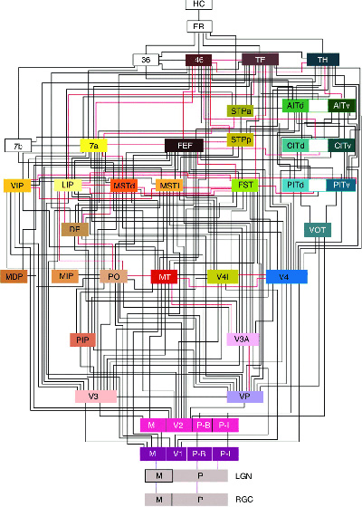{.img-shadow style="display: block; margin: 0 auto; width: 1400px;"}

::: {style="text-align: center; margin-top: 20px;"}
[Felleman and Van Essen (1991)](https://www.cns.nyu.edu/~tony/vns/readings/felleman-vanessen-1991.pdf)
:::


## {.center}

::: {style="margin: 0 auto; width: 85%;"}
::: columns
::: {.column width="38%"}
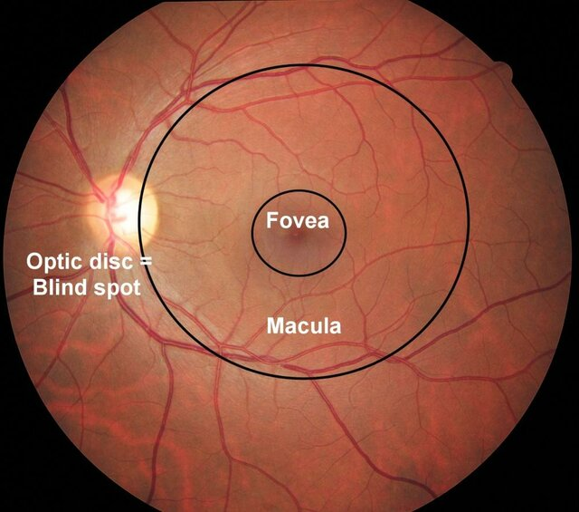{.img-shadow width="100%" style="height: 400px; object-fit: contain;"}

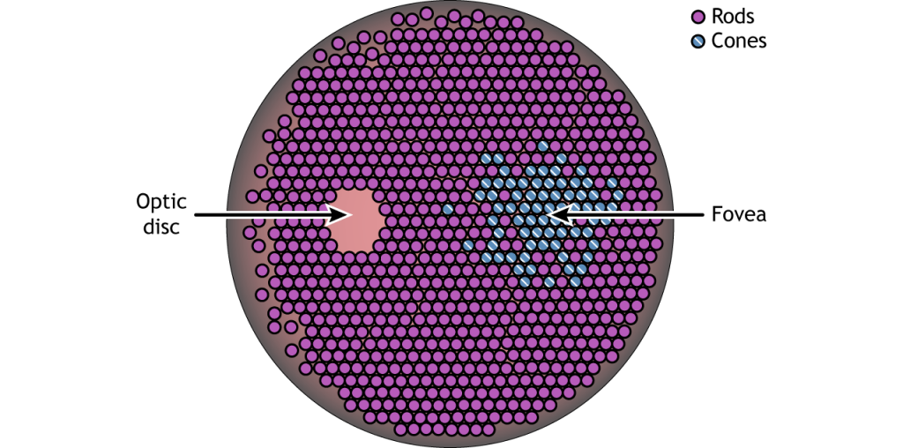{.img-shadow width="100%" style="margin-top: 20px;"}
:::
::: {.column width="62%"}
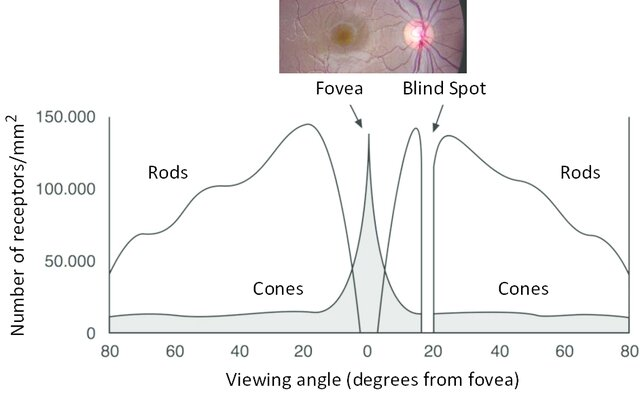{.img-shadow width="100%" style="height: 400px; object-fit: contain;"}
:::
:::
:::


::: footer
[Photo, 1D diagram](https://www.researchgate.net/publication/303550015_Laser_pointers_and_eye_injuries_An_analysis_of_reported_cases/figures?lo=1)

[2D diagram](https://openbooks.lib.msu.edu/introneuroscience1/chapter/vision-the-retina/)

:::


## 

::::: columns
::: {.column width="50%"}
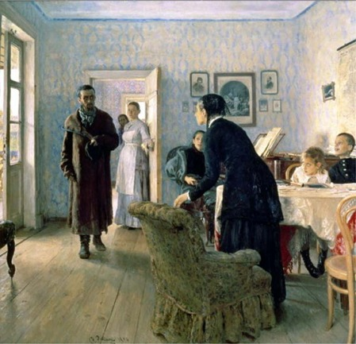{.img-shadow fig-align="center" width="90%"}
:::

::: {.column width="50%"}
The Unexpected Visitor. <br> [Oil on canvas painting by Ilya Repin, 1884–88.]{style="font-size: 0.8em; color: darkgray;"} <br> [(Source: Courtesy of www.ilyarepin.org.)]{style="font-size: 0.8em; color: darkgray;"}
:::
:::::

## 

:::::: columns
::: {.column width="40%"}
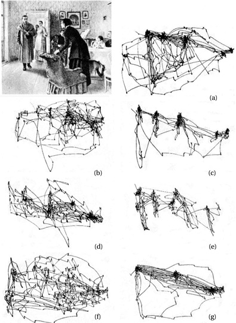{.img-shadow fig-align="center" width="90%"}
:::

:::: {.column .fragment width="50%" style="font-size: 0.85em;"}
**Tasks**

(a) Free examination
(b) Estimate the material circumstances of the family
(c) Give the ages of the people
(d) Surmise what the family had been doing before the arrival of the 'unexpected visitor'
(e) Remember the clothes worn by the people
(f) Remember the position of the people and objects in the room
(g) Estimate how long the unexpected visitor had been away from the family

::: footer
[Adpated from Yarbus (1967)](https://pmc.ncbi.nlm.nih.gov/articles/PMC3563050/)
:::
::::
::::::


## 


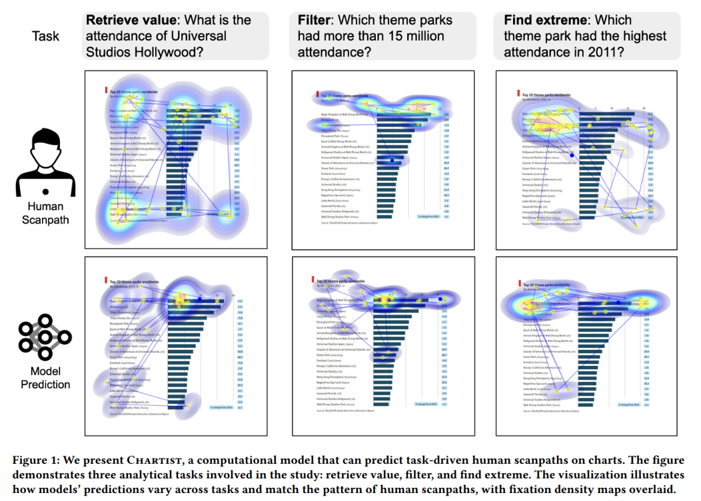{.img-shadow fig-align="center" width="90%"}

::: footer
[Shi et al. (2025)](https://dl.acm.org/doi/pdf/10.1145/3706598.3713128)
:::


# Modules and Automatic processing


## {.center}

::: {style="display: flex; justify-content: center; align-items: center;"}

:::

::: footer
[Wikipedia](https://en.wikipedia.org/wiki/Thatcher_effect)
:::


## seeing stuff that isn't there

<iframe src="https://en.wikipedia.org/wiki/Pareidolia" width="100%" height="900px" style="border: 2px solid #ccc;" allowfullscreen loading="lazy"></iframe>

::: footer
[Pareidolia - Wikipedia](https://en.wikipedia.org/wiki/Pareidolia)
:::


## Kanizsa illusion

<iframe width="100%" height="900px" src="https://www.youtube.com/embed/2ODdj9fhCMI" style="border: 2px solid #ccc;" allowfullscreen loading="lazy"></iframe>

::: footer
[Kanizsa Illusion - YouTube](https://www.youtube.com/watch?v=2ODdj9fhCMI)
:::


## Automatic Reading


<!--basic https://www.youtube.com/watch?v=E92GSwr46DY-->

<iframe width="100%" height="900px" src="https://www.youtube.com/embed/UAKAlP1B5WY" style="border: 2px solid #ccc;" allowfullscreen loading="lazy"></iframe>


::: footer
[The Stroop effect](https://en.wikipedia.org/wiki/Stroop_effect)
:::


## Color perception

<iframe width="100%" height="900px" src="https://www.youtube.com/embed/l8_fZPHasdo" style="border: 2px solid #ccc;" allowfullscreen loading="lazy"></iframe>

::: footer
[Color Perception - YouTube](https://www.youtube.com/watch?v=l8_fZPHasdo)
:::


# Visual illusions {background-color="#849ba5"}


## 

<iframe src="https://michaelbach.de/ot/" width="100%" height="900px" style="border: 2px solid #ccc;" allowfullscreen loading="lazy">

</iframe>

::: footer
[Optical illusions--Michael Bach](https://michaelbach.de/ot/)
:::


<!-- Percieved size -->


## 

<iframe src="https://michaelbach.de/ot/cog-Ebbinghaus/index.html" width="100%" height="900px" style="border: 2px solid #ccc;" allowfullscreen loading="lazy"></iframe>

::: footer
[Ebbinghaus Illusion - Michael Bach](https://michaelbach.de/ot/cog-Ebbinghaus/index.html)
:::


## 

<iframe src="https://michaelbach.de/ot/sze-shepardTerrors/index.html" width="100%" height="900px" style="border: 2px solid #ccc;" allowfullscreen loading="lazy"></iframe>

::: footer
[Shepard's Terror - Michael Bach](https://michaelbach.de/ot/sze-shepardTerrors/index.html)
:::


## 

<iframe src="https://michaelbach.de/ot/sze-ShepardTables/index.html" width="100%" height="900px" style="border: 2px solid #ccc;" allowfullscreen loading="lazy"></iframe>

::: footer
[Shepard Tables - Michael Bach](https://michaelbach.de/ot/sze-ShepardTables/index.html)
:::


## 

<iframe src="https://en.wikipedia.org/wiki/M%C3%BCller-Lyer_illusion" width="100%" height="900px" style="border: 2px solid #ccc;" allowfullscreen loading="lazy"></iframe>

::: footer
[Müller-Lyer illusion - Wikipedia](https://en.wikipedia.org/wiki/M%C3%BCller-Lyer_illusion)
:::


##


<iframe src="https://michaelbach.de/ot/sze-tIllusion/index.html" width="100%" height="900px" style="border: 2px solid #ccc;" allowfullscreen loading="lazy"></iframe>


::: footer
[T-illusion - Michael Bach](https://michaelbach.de/ot/sze-tIllusion/index.html)
:::


<!-- "Color" effects -->

## 

<iframe src="https://michaelbach.de/ot/lum-inducedBrightness/index.html" width="100%" height="900px" style="border: 2px solid #ccc;" allowfullscreen loading="lazy"></iframe>

::: footer
[Induced Brightness - Michael Bach](https://michaelbach.de/ot/lum-inducedBrightness/index.html)
:::


## 

<iframe src="https://michaelbach.de/ot/col-neon/index.html" width="100%" height="900px" style="border: 2px solid #ccc;" allowfullscreen loading="lazy"></iframe>

::: footer
[Neon Color Spreading - Michael Bach](https://michaelbach.de/ot/col-neon/index.html)
:::


## 

<iframe src="https://michaelbach.de/ot/col-watercolor/index.html" width="100%" height="900px" style="border: 2px solid #ccc;" allowfullscreen loading="lazy"></iframe>

::: footer
[Watercolor Illusion - Michael Bach](https://michaelbach.de/ot/col-watercolor/index.html)
:::


<!-- 3D perception related effects -->


## 

<iframe src="https://michaelbach.de/ot/lum-adelsonCheckShadow/index.html" width="100%" height="900px" style="border: 2px solid #ccc;" allowfullscreen loading="lazy"></iframe>

::: footer
[Adelson's Checkershadow Illusion - Michael Bach](https://michaelbach.de/ot/lum-adelsonCheckShadow/index.html)
:::


## 

<iframe src="https://michaelbach.de/ot/lum-shapeFromShading/index.html" width="100%" height="900px" style="border: 2px solid #ccc;" allowfullscreen loading="lazy"></iframe>

::: footer
[Shape from Shading - Michael Bach](https://michaelbach.de/ot/lum-shapeFromShading/index.html)
:::


## 

<iframe src="https://michaelbach.de/ot/sze-Necker/index.html" width="100%" height="900px" style="border: 2px solid #ccc;" allowfullscreen loading="lazy"></iframe>

::: footer
[Necker Cube - Michael Bach](https://michaelbach.de/ot/sze-Necker/index.html)
:::


<!-- Grouping 

## Dalmatian illusion

Prior knowledge affects grouping

<iframe src="https://michaelbach.de/ot/cog-Dalmatian/index.html" width="100%" height="900px" style="border: 2px solid #ccc;" allowfullscreen loading="lazy"></iframe>

::: footer
[Dalmatian Illusion - Michael Bach](https://michaelbach.de/ot/cog-Dalmatian/index.html)
:::

-->


## 

<iframe src="https://michaelbach.de/ot/col-isoluNuBleu/index.html" width="100%" height="900px" style="border: 2px solid #ccc;" allowfullscreen loading="lazy"></iframe>

::: footer
[Gestalt in Isoluminance - Michael Bach](https://michaelbach.de/ot/col-isoluNuBleu/index.html)
:::


# Attention


## 

<iframe width="100%" height="900px" src="https://www.youtube.com/embed/vJG698U2Mvo" style="border: 2px solid #ccc;" allowfullscreen loading="lazy"></iframe>

::: footer
[YouTube](https://www.youtube.com/watch?v=vJG698U2Mvo)
:::


## 

<iframe width="100%" height="900px" src="https://www.youtube.com/embed/GOF-saZ1XSQ" style="border: 2px solid #ccc;" allowfullscreen loading="lazy"></iframe>

::: footer
[YouTube](https://www.youtube.com/watch?v=GOF-saZ1XSQ)
:::


## 

<iframe width="100%" height="900px" src="https://www.youtube.com/embed/Yt3GVbH_uuE" style="border: 2px solid #ccc;" allowfullscreen loading="lazy"></iframe>

::: footer
[YouTube](https://www.youtube.com/watch?v=Yt3GVbH_uuE)
:::


# How do humans perceive graphs? {background-color="#849ba5"}


## Neural recycling

<div style="display: flex; gap: 20px; align-items: flex-start;">
<div style="width: 30%;">


</div>

<div style="width: 70%;">
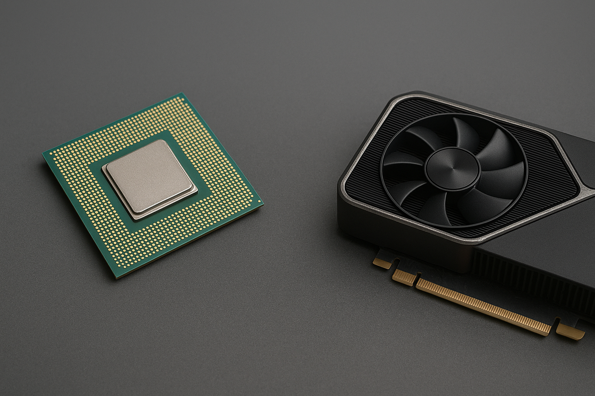
</div>
</div>


::: footer
[Course by Stanislas Dehaene (Collège de France)](https://www.college-de-france.fr/fr/agenda/cours/la-perception-des-graphiques-un-nouvel-exemple-de-recyclage-neuronal)

:::


## {.center}

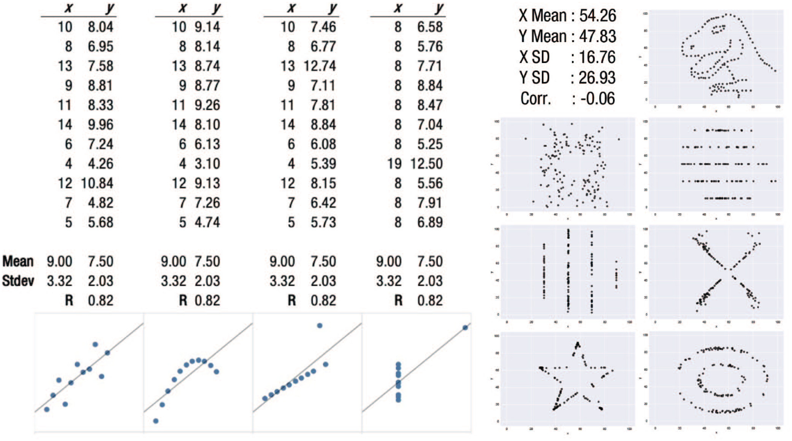

::: footer

https://journals.sagepub.com/doi/10.1177/15291006211051956

:::


## Mapping of data to visual attributes

<iframe src="https://www.lucypark.kr/courses/2015-dm/visualization.html" width="100%" height="700px" style="border: 2px solid black;"></iframe>


## How do you decide<br>which visual attributes<br>to map to your data? {.center}

# Quiz

## 1 {.center}

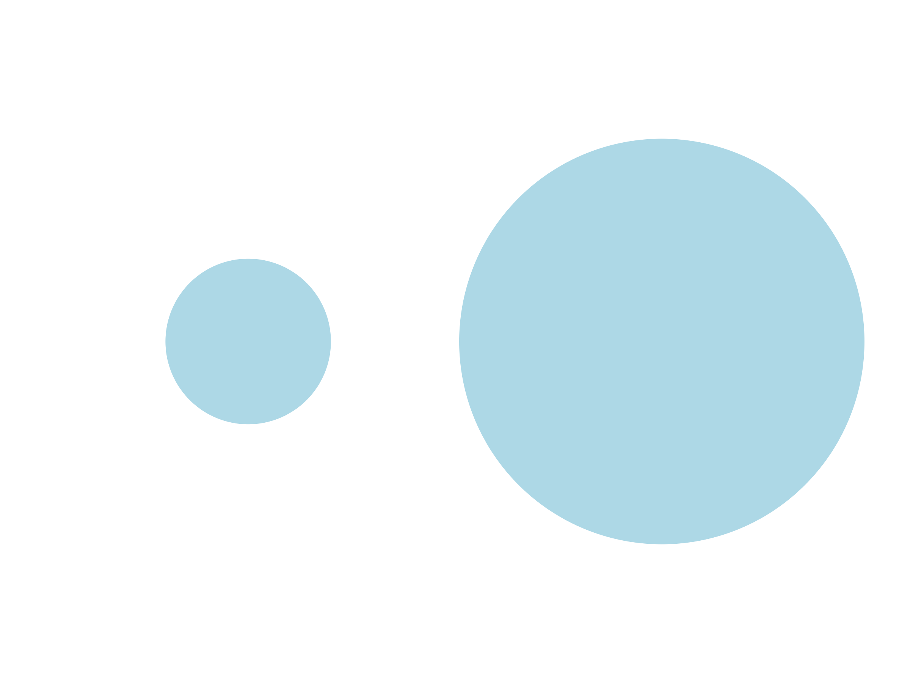{.img-shadow fig-align="center" width="70%"}


## 2 {.center}

{.img-shadow fig-align="center" width="70%"}


## 3 {.center}

{.img-shadow fig-align="center" width="70%"}


## 4 {.center}

{.img-shadow fig-align="center" width="70%"}

## 5 {.center}

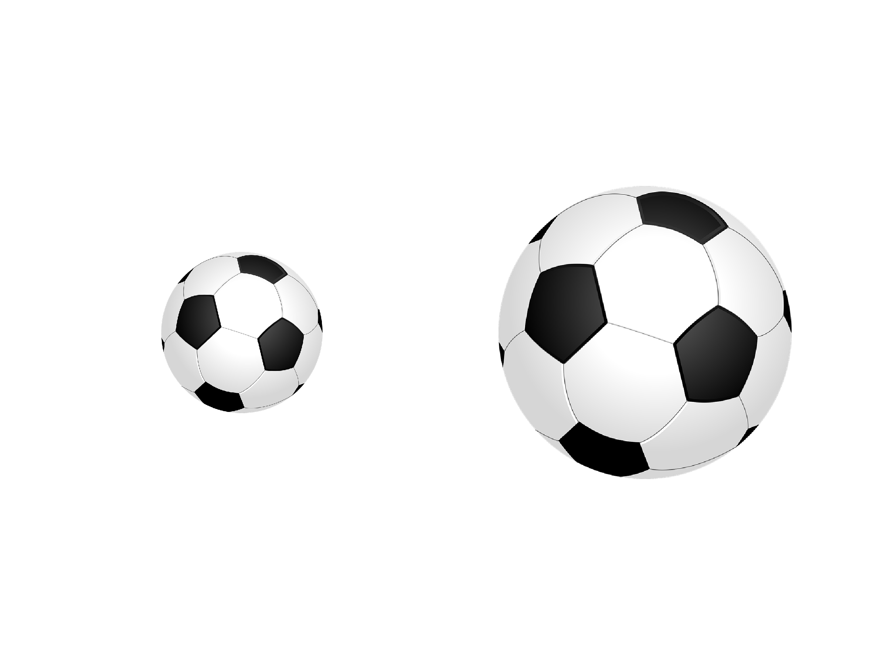{.img-shadow fig-align="center" width="70%"}


## 6 {.center}

{.img-shadow fig-align="center" width="70%"}


## 7 {.center}

{.img-shadow fig-align="center" width="70%"}


## 8 {.center}

{.img-shadow fig-align="center" width="70%"}


## 9 {.center}

{.img-shadow fig-align="center" width="70%"}


## 10 {.center}

{.img-shadow fig-align="center" width="70%"}


## Solutions {.center}


::: {.fragment}
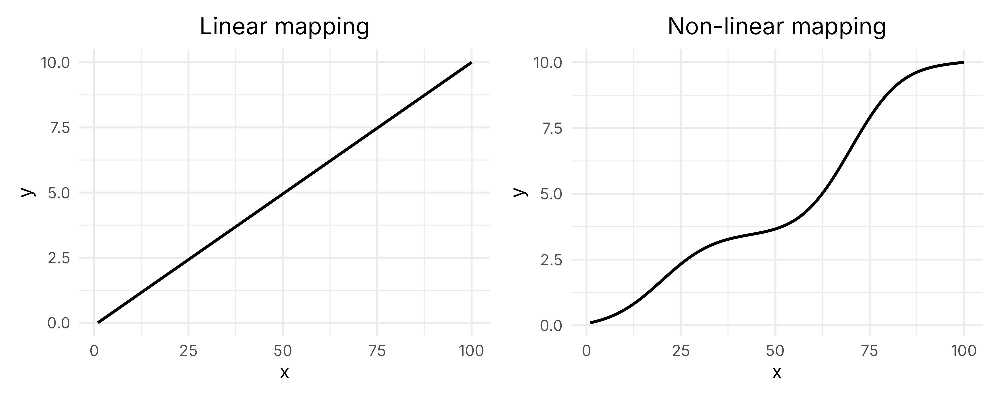{.img-shadow fig-align="center" width="70%"}
:::


# Vision psychophysics


## Stevens' Power law {.center}

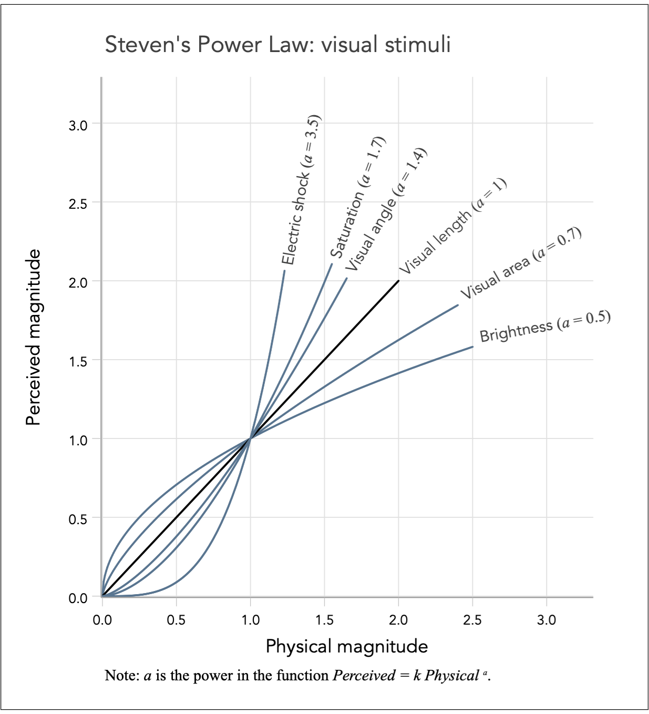{.img-shadow fig-align="center" width="70%"}

::: footer
https://graphworkflow.com/decoding/perceived-magnitude/

:::


##

<iframe src="https://en.wikipedia.org/wiki/Stevens%27s_power_law" width="100%" height="900px" style="border: 2px solid black;"></iframe>


## {.center}

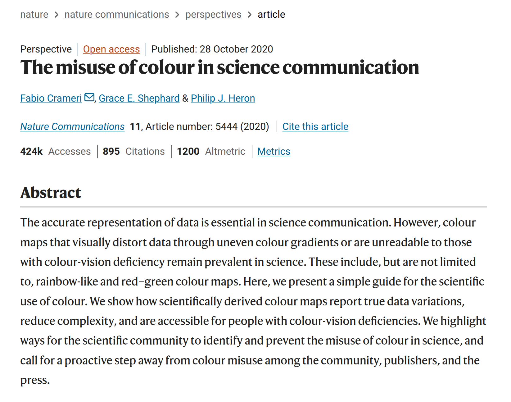{.img-shadow fig-align="center" width="60%"}


::: footer
[Crameri et al. (2020)](https://doi.org/10.1038/s41467-020-19160-7)
:::


# Studies on Graph perception

## {.center}

- [Cleveland & McGill (1984)](https://www.statsclass.org/dsci310/Notes/Cleveland_McGill_EPT.pdf)
- [Franconeri, S. L., Padilla, L. M., Shah, P., Zacks, J. M., & Hullman, J. (2021). The Science of Visual Data Communication: What Works. Psychological Science in the Public Interest, 22(3), 110-161.](https://journals.sagepub.com/doi/10.1177/15291006211051956)
- [Course by Stanislas Dehaene (Collège de France)](https://www.college-de-france.fr/fr/agenda/cours/la-perception-des-graphiques-un-nouvel-exemple-de-recyclage-neuronal)


::: notes
https://priceonomics.com/how-william-cleveland-turned-data-visualization/

http://vis.stanford.edu/papers/crowdsourcing-graphical-perception

https://idl.uw.edu/


Crowdsourcing Graphical Perception: Using Mechanical Turk to Assess Visualization Design
http://vis.stanford.edu/files/2010-MTurk-CHI.pdf
:::


## {.center}

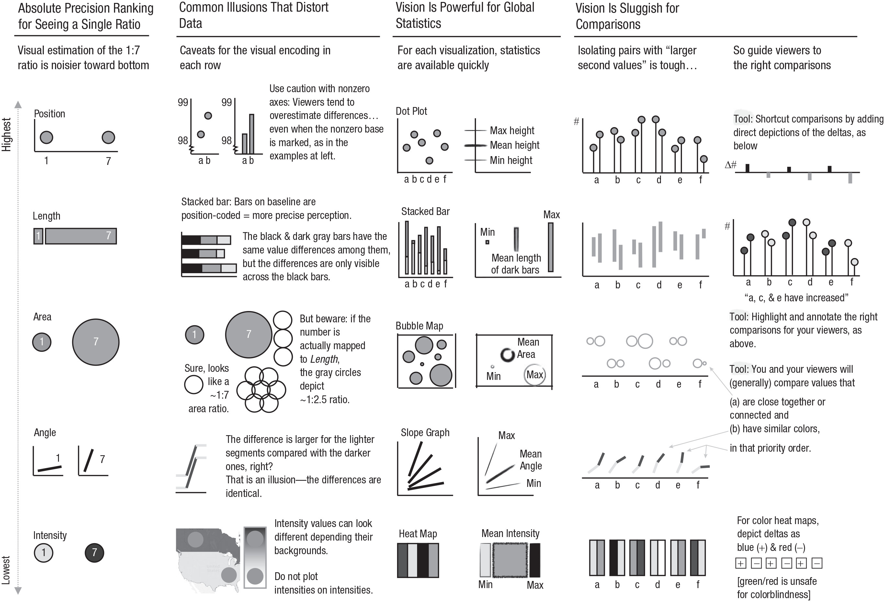{.img-shadow fig-align="center" width="60%"}

::: footer
https://journals.sagepub.com/doi/10.1177/15291006211051956
:::


## Text perception

::: columns

::: {.column width="50%"}
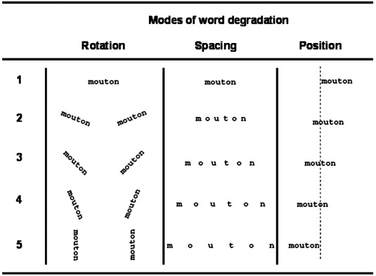{.img-shadow width="100%"}
:::

::: {.column width="40%" .fragment}
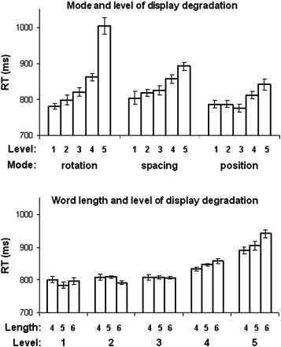{.img-shadow width="100%"}
:::
:::

::: footer
[Cohen et al. (2008)](https://www.sciencedirect.com/science/article/pii/S1053811907010762)
:::


## {.center}

::: {style="text-align: center;"}
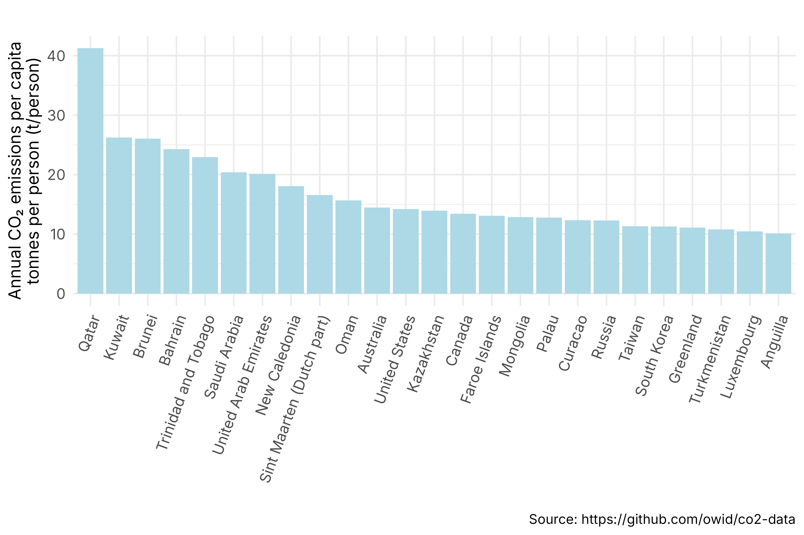
:::


## {.center}

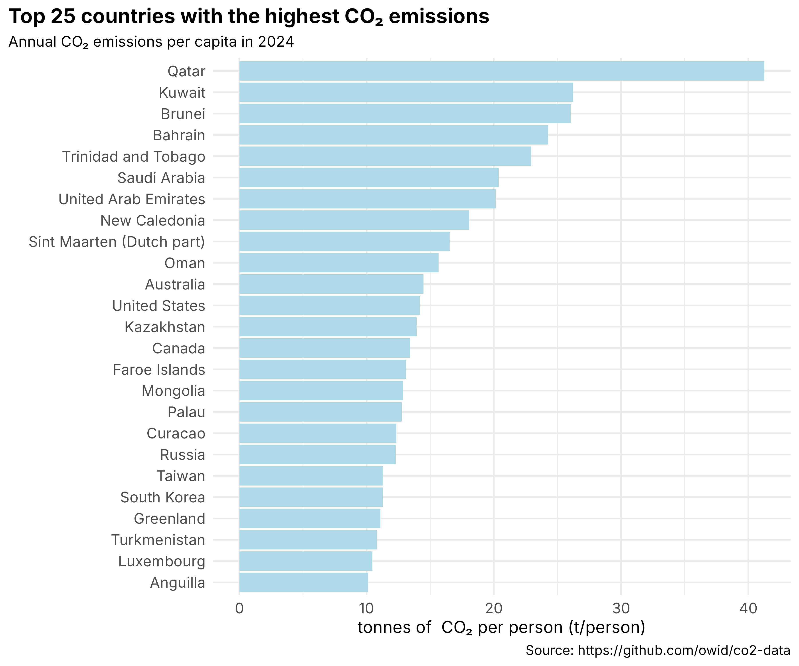{.img-shadow fig-align="center" width="60%"}


# Exercises


## 

<iframe src="https://www.gapminder.org/tools/?from=world#$chart-type=bubbles&url=v2" width="100%" height="900px" style="border: 2px solid black;"></iframe>

::: footer
<https://www.gapminder.org>
:::


##  {.center}

::: {style="display: flex; justify-content: center; align-items: center; width: 100%;"}
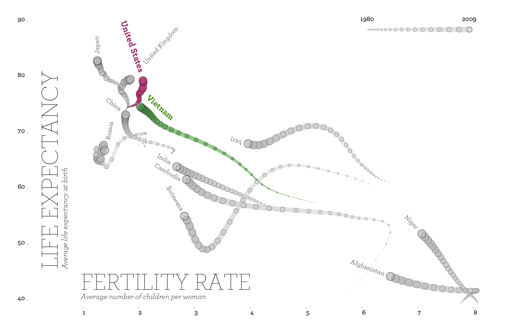{.img-shadow width="80%" style="display: block; margin: 0 auto;"}
:::

::: footer
[Remixing Rosling - Truth & Beauty](https://truth-and-beauty.net/projects/remixing-rosling)
:::


## Assignment


::: {.fragment}
Review your 4 images again.

For each image:

- identify the mapping of data to visual attributes
- describe what you think about those choices

:::

::: {.fragment}

Post 1 pdf with 1 page per image on Moodle.
:::


<!--
## Symmetry perception


## Automatic processing


Human graphical perception human graph comprehension

elementary perceptual tasks


collège de France slides: https://www.college-de-france.fr/sites/default/files/media/document/2025-01/dehaene_2024-2025_cours_24_janvier.pdf

“At their best, graphics are instruments for reasoning about quantitative information.Often, the most effective way to describe, explore and summarize a set of numbers – even a very large set –is to look at pictures of those numbers.”

course 2 is the most relevant here: https://www.college-de-france.fr/sites/default/files/media/document/2025-02/dehaene_2024-2025_cours_31_janvier.pdf

https://www.college-de-france.fr/fr/agenda/cours/la-perception-des-graphiques-un-nouvel-exemple-de-recyclage-neuronal/la-grammaire-des-courbes-et-des-graphiques


https://homepage.divms.uiowa.edu/~luke/classes/STAT4580/percep.html


## Pre-attentive features
https://readmedium.com/data-storytelling-101-the-magic-of-pre-attentive-attributes-522da9785f36

https://medium.com/microsoft-power-bi/data-storytelling-101-the-magic-of-pre-attentive-attributes-522da9785f36

# visual search; pop-out effects
https://www.openpsychologylabs.com/labs/visualsearchpopout.html

## Gestalt 
https://www.slideserve.com/calantha/visual-perception
https://www.slideserve.com/dieter/visual-perception

-->
