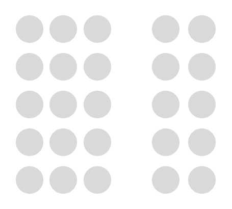
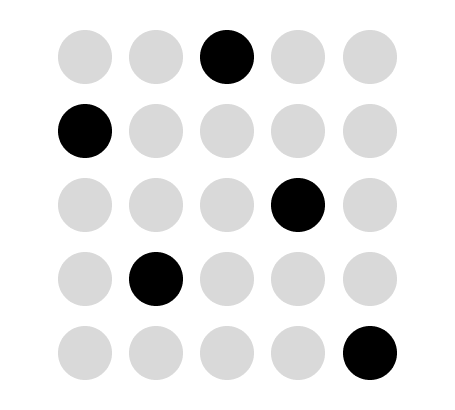
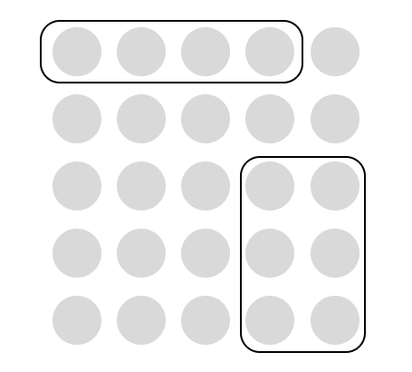
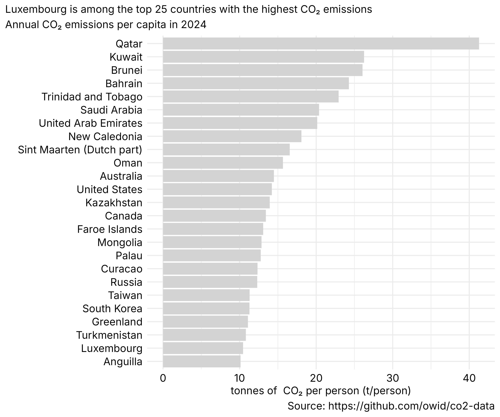
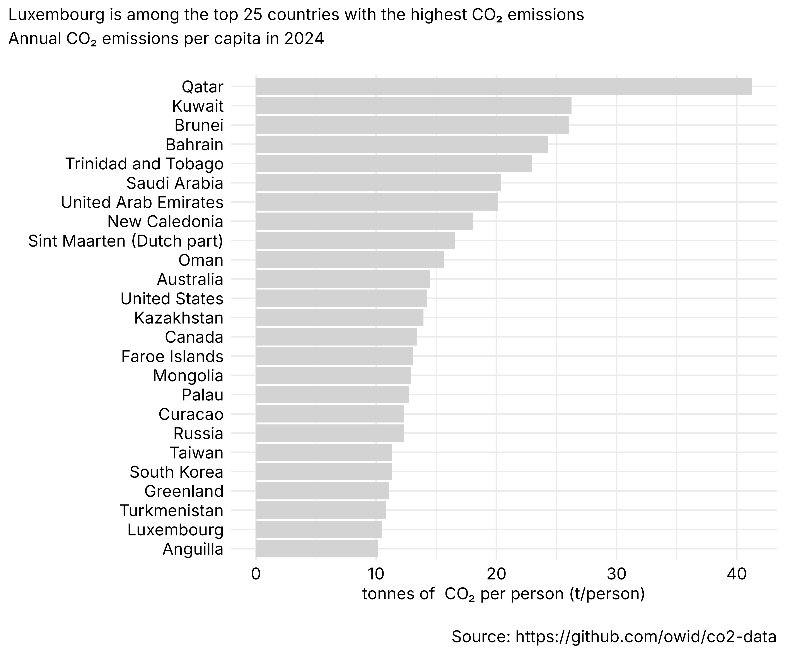
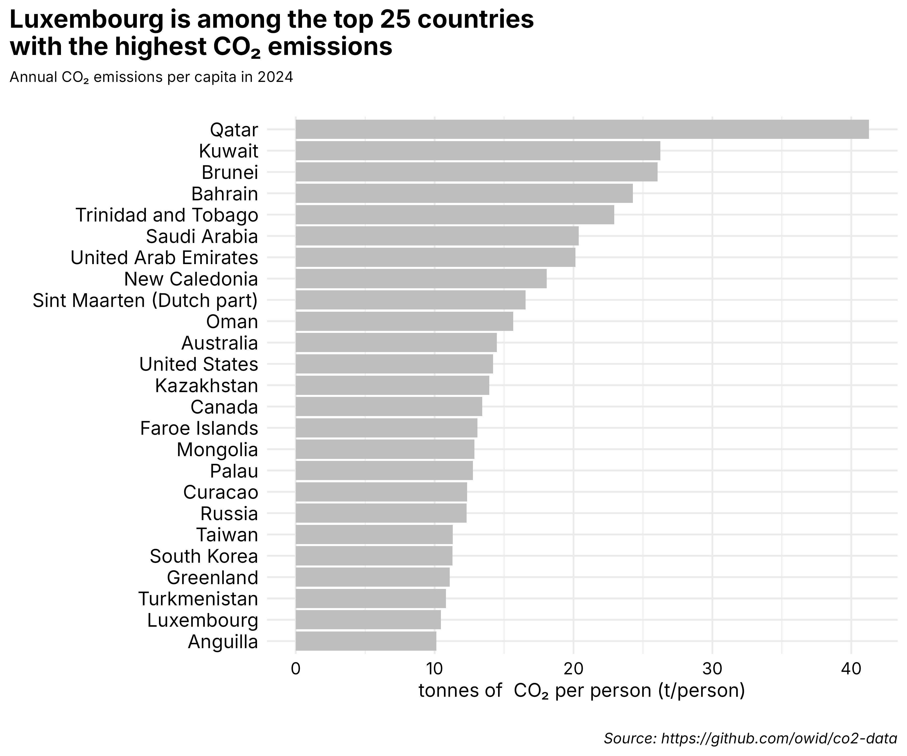
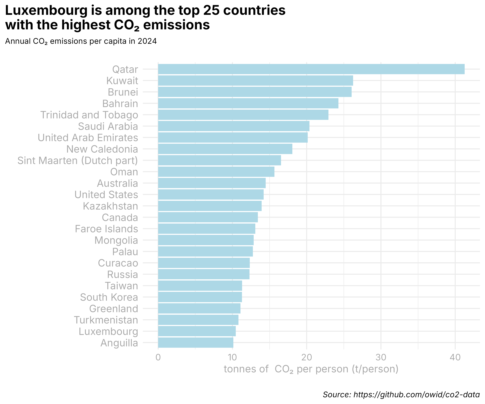
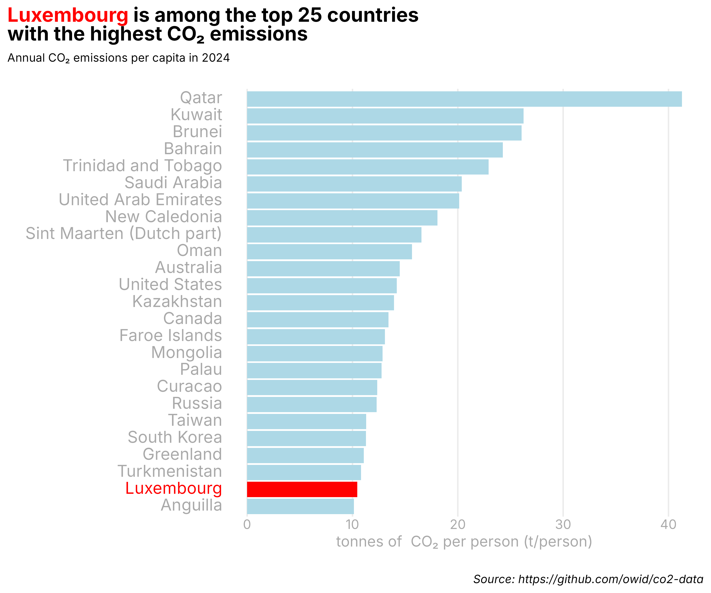
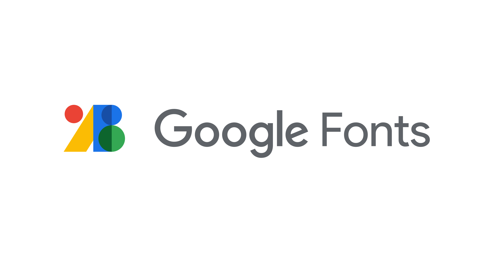
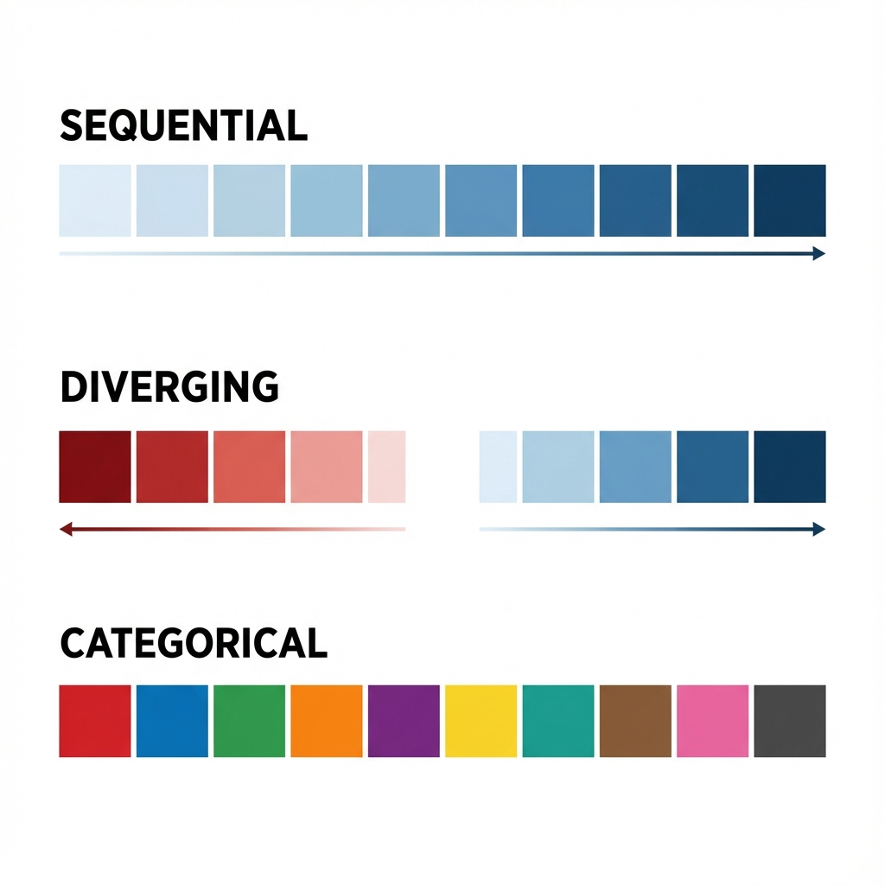

##  {.blurred-bg data-background-image="images/mondrian.jpg" data-background-size="cover"}

::::: {style="text-align: left; position: absolute; bottom: 150px; left: 50px; z-index: 10;"}
::: {style="background-color: rgba(247, 243, 243, 0.88); color:  rgba(245, 42, 42, 0.88); padding: 30px 40px; display: inline-block; margin-bottom: 20px;"}
<h2 style="margin: 0; color:  rgba(56, 55, 55, 0.88);">

The Art of Data visualization

</h2>
:::

 

::: {style="background-color: rgba(6, 23, 99, 0.55); color:  rgba(252, 252, 252, 0.88); padding: 15px 25px; display: inline-block;"}

Pedro Cardoso-Leite

<a href="mailto:pedro.cardosoleite@uni.lu" style="color: white;">pedro.cardosoleite\@uni.lu</a>

:::
:::::

::: {.footer style="color: white !important; text-shadow: 1px 1px 3px rgba(0, 0, 0, 0.8);"}
<a href="https://en.wikipedia.org/wiki/Piet_Mondrian" style="color: white !important; text-shadow: 1px 1px 3px rgba(0, 0, 0, 0.8);">Piet Mondrian (1921) Tableau 1</a>
:::

<link rel="preconnect" href="https://fonts.googleapis.com">
<link rel="preconnect" href="https://fonts.gstatic.com" crossorigin>
<link href="https://fonts.googleapis.com/css2?family=Libre+Baskerville:ital,wght@0,400;0,700;1,400&family=Roboto:ital,wght@0,100;0,300;0,400;0,500;0,700;0,900;1,100;1,300;1,400;1,500;1,700;1,900&family=Roboto+Condensed:ital,wght@0,100..900;1,100..900&family=Monsieur+La+Doulaise&family=Comic+Relief&display=swap" rel="stylesheet">

## {.center}

Key Design principles for data visualization

::: {.fragment}
- Gestalt theory (hierarchy, contrast, structure)
:::

::: {.fragment}
- Typography
:::

::: {.fragment}
- Color
:::

# Gestalt Theory

## {.center}

::: {.img-shadow style="background: white; padding: 60px 80px; border-radius: 12px; max-width: 1200px; margin: 0 auto;"}

::: {.fragment style="border-left: 4px solid #849ba5; padding-left: 30px; margin-bottom: 40px;"}

We don't perceive individual elements, 

:::

::: {.fragment style="border-left: 4px solid #849ba5; padding-left: 30px;"}

we perceive "Gestalts":  the elements interact to form a perception. 

:::

::: {style="text-align: right; margin-top: 30px; font-size: 0.9em; color: #666;"}
— [Wikipedia: Gestalt Psychology](https://en.wikipedia.org/wiki/Gestalt_psychology)
:::

:::

## {.center}

{.img-shadow width="500" style="display: block; margin: 0 auto; height: auto;"}

::: footer
No structure
:::

## {.center}

{.img-shadow width="500" style="display: block; margin: 0 auto; height: auto;"}

::: footer
Proximity
:::

## {.center}

{.img-shadow width="500" style="display: block; margin: 0 auto; height: auto;"}

::: footer
Similarity
:::

##  {.center}

{.img-shadow width="500" style="display: block; margin: 0 auto; height: auto;"}

::: footer
Enclosure
:::

##  {.center}

{.img-shadow width="500" style="display: block; margin: 0 auto; height: auto;"}

::: footer
Connection
:::

## {.center}

::: {style="display: grid; grid-template-columns: repeat(3, 1fr); gap: 30px; padding: 40px;"}

::: {.img-shadow .fragment style="background: #f5f5f5; padding: 30px; border-radius: 8px; font-size: 1.1em;"}
Manager

John Doe

Architect

Jane Doe

Computer scientist

John Smith

Engineer
:::

::: {.img-shadow .fragment style="background: #f5f5f5; padding: 30px; border-radius: 8px; font-size: 1.1em; line-height: 1.0;"}

Manager

John Doe

Architect

Jane Doe

Computer scientist

John Smith

Engineer

:::

::: {.img-shadow .fragment style="background: #f5f5f5; padding: 30px; border-radius: 8px; font-size: 1.1em; line-height: 1.2;"}

Manager

John Doe

Architect

Jane Doe

Computer scientist

John Smith

Engineer

:::

:::

## {.center}

::: {style="display: grid; grid-template-columns: repeat(3, 1fr); gap: 30px; padding: 40px;"}

::: {.img-shadow .fragment style="background: #f5f5f5; padding: 30px; border-radius: 8px; font-size: 1.1em;"}
Manager 
John Doe 
Architect 
Jane Doe 
Computer scientist 
John Smith 
Engineer
:::

::: {.img-shadow .fragment style="background: #f5f5f5; padding: 30px; border-radius: 8px; font-size: 1em; line-height: 1.0;"}

Manager

John Doe

Architect

Jane Doe

Computer scientist

John Smith

Engineer

:::

::: {.img-shadow .fragment style="background: #f5f5f5; padding: 30px; border-radius: 8px; font-size: 1.1em; line-height: 1.2;"}

Manager

John Doe

Architect

Jane Doe

Computer scientist

John Smith

Engineer

:::

:::

## {.center}

::: {style="display: grid; grid-template-columns: repeat(3, 1fr); gap: 30px; padding: 40px;"}

::: {.img-shadow .fragment style="background: #f5f5f5; padding: 30px; border-radius: 8px; font-size: 1.1em;"}
Manager 
John Doe 
Architect 
Jane Doe 
Computer scientist 
John Smith 
Engineer
:::

::: {.img-shadow .fragment style="background: #f5f5f5; padding: 30px; border-radius: 8px; font-size: 1em; line-height: 1.0;"}

Manager

John Doe

Architect

Jane Doe

Computer scientist

John Smith

Engineer

:::

::: {.img-shadow .fragment style="background: #f5f5f5; padding: 30px; border-radius: 8px; font-size: 1.1em; line-height: 1.2;"}

Manager

John Doe

Architect

Jane Doe

Computer scientist

John Smith

Engineer

:::

:::

## {.center}

::: {style="display: grid; grid-template-columns: repeat(3, 1fr); gap: 30px; padding: 40px;"}

::: {.img-shadow .fragment style="background: #f5f5f5; padding: 30px; border-radius: 8px; font-size: 1.1em;"}
Manager 
John Doe 
Architect 
Jane Doe 
Computer scientist 
John Smith 
Engineer
:::

::: {.img-shadow .fragment style="background: #f5f5f5; padding: 30px; border-radius: 8px; font-size: 1em; line-height: 1.0;"}

Manager

John Doe

Architect

Jane Doe

Computer scientist

John Smith

Engineer

:::

::: {.img-shadow .fragment style="background: #f5f5f5; padding: 30px; border-radius: 8px; font-size: 1.1em; line-height: 1.2;"}

Manager

John Doe

Architect

Jane Doe

Computer scientist

John Smith

Engineer

:::

:::

# Data Viz example

## {.center}

::: {style="display: flex; justify-content: center; align-items: center; width: 100%;"}
{.img-shadow width="1000px" style="display: block; margin: 0 auto;"}
:::

## {.center}

::: {style="display: flex; justify-content: center; align-items: center; width: 100%;"}
{.img-shadow width="1000px" style="display: block; margin: 0 auto;"}
:::

## {.center}

::: {style="display: flex; justify-content: center; align-items: center; width: 100%;"}
{.img-shadow width="1000px" style="display: block; margin: 0 auto;"}
:::

## {.center}

::: {style="display: flex; justify-content: center; align-items: center; width: 100%;"}
{.img-shadow width="1000px" style="display: block; margin: 0 auto;"}
:::

## {.center}

::: {style="display: flex; justify-content: center; align-items: center; width: 100%;"}
{.img-shadow width="1000px" style="display: block; margin: 0 auto;"}
:::

# Typography

## {.center}

::: {.img-shadow style="background: white; padding: 60px 80px; border-radius: 12px; max-width: 1200px; margin: 0 auto;"}

::: {.fragment style="border-left: 4px solid #849ba5; padding-left: 30px; margin-bottom: 40px;"}

Typography is the art and technique of arranging type to make written language legible, readable and appealing when displayed.

:::

::: {.fragment style="border-left: 4px solid #849ba5; padding-left: 30px;"}

The arrangement of type involves selecting typefaces, point sizes, line lengths, line spacing, letter spacing, and spaces between pairs of letters.

:::

::: {style="text-align: right; margin-top: 30px; font-size: 0.9em; color: #666;"}
— [Wikipedia: Typography](https://en.wikipedia.org/wiki/Typography)
:::

:::

## {.center}

::: {style="display: grid; grid-template-columns: repeat(4, 1fr); gap: 20px; padding: 20px;"}

::: {.fragment style="display: contents;"}
::: {.img-shadow style="background: #f5f5f5; padding: 20px; border-radius: 8px; font-family: 'Libre Baskerville', serif; font-size: 1em; transition: transform 0.3s ease, box-shadow 0.3s ease;"}
I'm sorry.
:::

::: {.img-shadow style="background: #f5f5f5; padding: 20px; border-radius: 8px; font-family: 'Inter', sans-serif; font-size: 1em; transition: transform 0.3s ease, box-shadow 0.3s ease;"}
I'm sorry.
:::

::: {.img-shadow style="background: #f5f5f5; padding: 20px; border-radius: 8px; font-family: 'Monsieur La Doulaise', cursive; font-size: 1.2em; transition: transform 0.3s ease, box-shadow 0.3s ease;"}
I'm sorry.
:::

::: {.img-shadow style="background: #f5f5f5; padding: 20px; border-radius: 8px; font-family: 'Comic Relief', cursive; font-size: 1em; transition: transform 0.3s ease, box-shadow 0.3s ease;"}
I'm sorry.
:::
:::

::: {.fragment style="display: contents;"}
::: {.img-shadow style="background: #f5f5f5; padding: 20px; border-radius: 8px; font-family: 'Libre Baskerville', serif; font-size: 1em; transition: transform 0.3s ease, box-shadow 0.3s ease;"}
It's my 5^th^ birthday!
:::

::: {.img-shadow style="background: #f5f5f5; padding: 20px; border-radius: 8px; font-family: 'Inter', sans-serif; font-size: 1em; transition: transform 0.3s ease, box-shadow 0.3s ease;"}
It's my 5^th^ birthday!
:::

::: {.img-shadow style="background: #f5f5f5; padding: 20px; border-radius: 8px; font-family: 'Monsieur La Doulaise', cursive; font-size: 1.2em; transition: transform 0.3s ease, box-shadow 0.3s ease;"}
It's my 5^th^ birthday!
:::

::: {.img-shadow style="background: #f5f5f5; padding: 20px; border-radius: 8px; font-family: 'Comic Relief', cursive; font-size: 1em; transition: transform 0.3s ease, box-shadow 0.3s ease;"}
It's my 5^th^ birthday!
:::
:::

::: {.fragment style="display: contents;"}
::: {.img-shadow style="background: #f5f5f5; padding: 20px; border-radius: 8px; font-family: 'Libre Baskerville', serif; font-size: 1em; transition: transform 0.3s ease, box-shadow 0.3s ease;"}
The Royal Society
:::

::: {.img-shadow style="background: #f5f5f5; padding: 20px; border-radius: 8px; font-family: 'Inter', sans-serif; font-size: 1em; transition: transform 0.3s ease, box-shadow 0.3s ease;"}
The Royal Society
:::

::: {.img-shadow style="background: #f5f5f5; padding: 20px; border-radius: 8px; font-family: 'Monsieur La Doulaise', cursive; font-size: 1.2em; transition: transform 0.3s ease, box-shadow 0.3s ease;"}
The Royal Society
:::

::: {.img-shadow style="background: #f5f5f5; padding: 20px; border-radius: 8px; font-family: 'Comic Relief', cursive; font-size: 1em; transition: transform 0.3s ease, box-shadow 0.3s ease;"}
The Royal Society
:::
:::

::: {.fragment style="display: contents;"}
::: {.img-shadow style="background: #f5f5f5; padding: 20px; border-radius: 8px; font-family: 'Libre Baskerville', serif; font-size: 1em; transition: transform 0.3s ease, box-shadow 0.3s ease;"}
Climate change is real.
:::

::: {.img-shadow style="background: #f5f5f5; padding: 20px; border-radius: 8px; font-family: 'Inter', sans-serif; font-size: 1em; transition: transform 0.3s ease, box-shadow 0.3s ease;"}
Climate change is real.
:::

::: {.img-shadow style="background: #f5f5f5; padding: 20px; border-radius: 8px; font-family: 'Monsieur La Doulaise', cursive; font-size: 1.2em; transition: transform 0.3s ease, box-shadow 0.3s ease;"}
Climate change is real.
:::

::: {.img-shadow style="background: #f5f5f5; padding: 20px; border-radius: 8px; font-family: 'Comic Relief', cursive; font-size: 1em; transition: transform 0.3s ease, box-shadow 0.3s ease;"}
Climate change is real.
:::
:::

:::

## {.center}

::: {style="display: grid; grid-template-columns: repeat(2, 1fr); gap: 40px; padding: 40px; max-width: 1200px; margin: 0 auto;"}

::: {.img-shadow style="background: white; padding: 50px; border-radius: 8px; text-align: center; min-height: 200px; display: flex; flex-direction: column; justify-content: center;"}

Serif

Libre Baskerville

:::

::: {.img-shadow style="background: white; padding: 50px; border-radius: 8px; text-align: center; min-height: 200px; display: flex; flex-direction: column; justify-content: center;"}

Sans Serif

Inter

:::

::: {.img-shadow style="background: white; padding: 50px; border-radius: 8px; text-align: center; min-height: 200px; display: flex; flex-direction: column; justify-content: center;"}

Display

Monsieur La Doulaise

:::

::: {.img-shadow style="background: white; padding: 50px; border-radius: 8px; text-align: center; min-height: 200px; display: flex; flex-direction: column; justify-content: center;"}

Monospace

Courier New

:::

:::

## 

::: {style="display: grid; grid-template-columns: repeat(3, 1fr); gap: 30px; padding: 40px; max-width: 1400px; margin: 0 auto;"}

::: {.img-shadow style="background: white; padding: 40px; border-radius: 8px; text-align: center;"}

Roboto Thin

Weight: 100

:::

::: {.img-shadow style="background: white; padding: 40px; border-radius: 8px; text-align: center;"}

Roboto Light

Weight: 300

:::

::: {.img-shadow style="background: white; padding: 40px; border-radius: 8px; text-align: center;"}

Roboto Regular

Weight: 400

:::

::: {.img-shadow style="background: white; padding: 40px; border-radius: 8px; text-align: center;"}

Roboto Bold

Weight: 700

:::

::: {.img-shadow style="background: white; padding: 40px; border-radius: 8px; text-align: center;"}

Roboto Black

Weight: 900

:::

::: {.img-shadow style="background: white; padding: 40px; border-radius: 8px; text-align: center;"}

Roboto Italic

Italic style

:::

::: {.img-shadow style="background: white; padding: 40px; border-radius: 8px; text-align: center;"}

Roboto Condensed Light

Condensed 300

:::

::: {.img-shadow style="background: white; padding: 40px; border-radius: 8px; text-align: center;"}

Roboto Condensed Bold

Condensed 700

:::

::: {.img-shadow style="background: white; padding: 40px; border-radius: 8px; text-align: center;"}

Roboto Condensed Italic

Condensed Italic

:::

:::

## {.center}

::: {style="display: flex; justify-content: center; align-items: center; width: 100%;"}
[{.img-shadow width="1200px" style="display: block; margin: 0 auto;"}](https://fonts.google.com/)
:::

::: footer
[fonts.google.com](https://fonts.google.com/)
:::

# Color

## Color Theory

- [Color Space](https://en.wikipedia.org/wiki/Color_space)
- [Color Theory](https://www.interaction-design.org/literature/topics/color-theory)
- [UI Color Palette](https://www.interaction-design.org/literature/article/ui-color-palette?r=pedro-cardoso-leite)
- [Understand Color Symbolism](https://www.interaction-design.org/literature/article/understand-color-symbolism)

## {.center}

<iframe src="https://www.datawrapper.de/blog/gendercolor" width="100%" height="700px" style="border: 2px solid #ccc;"></iframe>

::: footer
[Gender and Color](https://www.datawrapper.de/blog/gendercolor)
:::

# Color palettes for data visualization

## {.center}

{.img-shadow width="700px" style="display: block; margin: 0 auto;"}

## {.center}

<iframe src="https://www.datawrapper.de/blog/create-good-color-palettes" width="100%" height="700px" style="border: 2px solid #ccc;"></iframe>

::: footer
[Create Good Color Palettes](https://www.datawrapper.de/blog/create-good-color-palettes)
:::

## {.center}

<iframe src="https://www.datawrapper.de/blog/color-contrast-check-data-vis-wcag-apca" width="100%" height="700px" style="border: 2px solid #ccc;"></iframe>

::: footer
[Color Contrast Check](https://www.datawrapper.de/blog/color-contrast-check-data-vis-wcag-apca)
:::

## {.center}

<iframe src="https://projects.susielu.com/viz-palette?colors=[%22#ffd700%22,%22#ffb14e%22,%22#fa8775%22,%22#ea5f94%22,%22#cd34b5%22,%22#9d02d7%22,%22#0000ff%22]&backgroundColor=%22white%22&fontColor=%22black%22&mode=%22normal%22" width="100%" height="700px" style="border: 2px solid #ccc;"></iframe>

::: footer
[Viz Palette](https://projects.susielu.com/viz-palette)
:::

# Styleguides

## {.center}

<iframe src="https://urbaninstitute.github.io/graphics-styleguide/" width="100%" height="700px" style="border: 2px solid #ccc;"></iframe>

::: footer
[Urban Institute Style Guide](https://urbaninstitute.github.io/graphics-styleguide/)
:::

# Tools

## {.center}

<iframe src="https://colorbrewer2.org/#type=sequential&scheme=BuGn&n=3" width="100%" height="700px" style="border: 2px solid #ccc;"></iframe>

::: footer
[ColorBrewer 2.0](https://colorbrewer2.org/)
:::

## {.center}

<iframe src="https://projects.susielu.com/viz-palette" width="100%" height="700px" style="border: 2px solid #ccc;"></iframe>

::: footer
[Viz Palette Tool](https://projects.susielu.com/viz-palette)
:::

## {.center}

<iframe src="https://r-graph-gallery.com/color-palette-finder?s=09" width="100%" height="700px" style="border: 2px solid #ccc;"></iframe>

::: footer
[R Color Palette Finder](https://r-graph-gallery.com/color-palette-finder)
:::

<!-- Tools for designers in general -->

## {.center}

<iframe src="https://coolors.co/" width="100%" height="700px" style="border: 2px solid #ccc;"></iframe>

::: footer
[Coolors](https://coolors.co/)
:::

## {.center}

<iframe src="https://huemint.com/" width="100%" height="700px" style="border: 2px solid #ccc;"></iframe>

::: footer
[Huemint](https://huemint.com/)
:::

# Key message

## {.center}

::: {style="display: flex; align-items: center; justify-content: center; height: 100%;"}
::: {.img-shadow style="background: white; padding: 100px; border-radius: 12px; font-size: 1.5em; max-width: 90%; text-align: center;"}
::: {.fragment}
differences in meaning ⟺ visual differences
:::

::: {.fragment style="margin-top: 50px;"}
semantic similarity = visual similarity
:::
:::
:::

# 

